# Specifikacija softvera

## Dom zdravlja

**Verzija:** 1.0

## Sadržaj

1. [Uvod](#1-uvod)
   1. [Namjena](#11-namjena)
   2. [Obim](#12-obim)
   3. [Definicije, akronimi i skraćenice](#13-definicije-akronimi-i-skraćenice)
      1. [Definicije](#131-definicije)
      2. [Akronimi i skraćenice](#132-akronimi-i-skraćenice)
   4. [Reference](#14-reference)
   5. [Pregled](#15-pregled)
2. [Glavni opis](#2-glavni-opis)
   1. [Perspektive proizvoda](#21-perspektive-proizvoda)
   2. [Funkcije proizvoda](#22-funkcije-proizvoda)
   3. [Karakteristike korisnika](#23-karakteristike-korisnika)
   4. [Ograničenja](#24-ograničenja)
   5. [Raspodjela zahtjeva](#25-raspodjela-zahtjeva)
3. [Zahtjevi](#3-zahtjevi)
   1. [Vanjski zahtjevi](#31-vanjski-zahtjevi)
      1. [Korisnički interfejsi](#311-korisnički-interfejsi)
      2. [Hardverski interfejsi](#312-hardverski-interfejsi)
      3. [Softverski interfejsi](#313-softverski-interfejsi)
      4. [Komunikacioni interfejsi](#314-komunikacioni-interfejsi)
      5. [Memorijska ograničenja](#315-memorijska-ograničenja)
      6. [Operacije](#316-operacije)
   2. [Specifični zahtjevi](#32-specifični-zahtjevi)
      1. [Dijagrami sekvenci i aktivnosti](#321-dijagrami-sekvenci-i-aktivnosti)
   3. Performanse
   4. Dizajn sistema
   5. Atributi sistema
4. Dodaci

---

## 1. Uvod

### 1.1. Namjena

Specifikacija softvera je dokument koji sadrži detaljan opis izgleda krajnjeg proizvoda. Ovaj dokument se piše sa ciljem da se unaprijedi proces razvoja softvera i da aplikacija koja se kreira zadovolji zahtjeve klijenata sa bilo kog nivoa korišćenja. Takođe, dokument jasno definiše funkcije, tako da one ne mogu dovesti do dvosmislenosti sistemskih zahtjeva.

Da bi se izbjegle improvizacije i neočekivani troškovi pri izradi softvera, ovaj dokument se piše prije početka implementacije.

### 1.2. Obim

Web aplikacija *Dom zdravlja* se razvija u cilju digitalizacije i unapređenja poslovanja doma zdravlja. Aplikacija je namijenjena pacijentima koji žele zakazati pregled, pregledati svoj zdravstveni karton i pratiti istoriju posjeta, kao i ljekarima koji vode preglede, izdaju recepte i uputnice. Pored njih, aplikaciju koriste i medicinske sestre koje upravljaju rasporedom i vrše prijem pacijenata, te administrator sistema koji upravlja korisnicima i konfiguracijom.

Kroz ovaj dokument su prikazani zahtjevi koje treba da ispunjava prva verzija web aplikacije. Zahtjevi su napisani tako da se postigne potpuna funkcionalnost aplikacije. Verzija aplikacije, čija specifikacija softverskih zahtjeva je predstavljena u ovom dokumentu, je verzija 0.1.

### 1.3. Definicije, akronimi i skraćenice

#### 1.3.1. Definicije

| Pojam | Opis |
|-------|------|
| **Administrator** | Osoba koja dodaje novog korisnika u sistem, mijenja podatke korisnicima, mijenja uloge korisnicima i briše korisnike iz sistema. Administrator takođe konfiguriše parametre sistema (radno vrijeme, odjeljenja, ordinacije). |
| **Ljekar** | Osoba koja vodi preglede pacijenata, postavlja dijagnoze, izdaje recepte za lijekove i uputnice za specijalističke preglede. Ljekar ima uvid u zdravstveni karton pacijenta. |
| **Medicinska sestra** | Osoba koja upravlja rasporedom ljekara, vrši prijem i trijažu pacijenata, te ažurira termine pregleda. |
| **Pacijent** | Osoba koja zakazuje preglede kod ljekara, ima uvid u svoj zdravstveni karton, istoriju pregleda, izdate recepte i uputnice. Pacijent može i ocijeniti ljekara. |
| **Korisnik** | Osoba koja izvršava funkcije na sajtu zajedničke za administratora, ljekara, medicinsku sestru i pacijenta. |
| **Gost** | Osoba koja može pregledati osnovni sadržaj web sajta (informacije o domu zdravlja, radno vrijeme, kontakt) bez prijave na sistem. |
| **Zdravstveni karton** | Elektronski dokument koji sadrži kompletnu medicinsku istoriju pacijenta — dijagnoze, preglede, recepte, uputnice i bilješke ljekara. |
| **Pregled** | Zakazani termin kod ljekara u okviru kojeg se vrši medicinski pregled pacijenta, postavlja dijagnoza i propisuje terapija. |
| **Recept** | Elektronski dokument koji ljekar izdaje pacijentu za nabavku propisanih lijekova u apoteci. |
| **Uputnica** | Elektronski dokument koji ljekar opšte prakse izdaje pacijentu za upućivanje na specijalistički pregled ili dijagnostičku proceduru. |
| **Termin** | Vremenski slot u rasporedu ljekara koji je dostupan za zakazivanje pregleda. |
| **Odjeljenje** | Organizaciona jedinica doma zdravlja koja objedinjuje ljekare iste ili srodne specijalnosti (npr. opšta praksa, pedijatrija, internistika). |
| **Registracija** | Aktivnost koju pacijent izvršava popunjavanjem ličnih podataka i podataka o zdravstvenom osiguranju radi kreiranja naloga u sistemu. Nakon registracije, pacijent se može prijaviti na sajt. |
| **Prijava** | Aktivnost koju korisnik vrši popunjavanjem određenih polja (e-mail i lozinka) kako bi potvrdio svoj identitet i mogao pristupati sadržaju web aplikacije. |
| **Odjava** | Aktivnost koju korisnik vrši pri napuštanju web aplikacije. |
| **Pristupni podaci** | Podaci sa kojima se korisnik prijavljuje na sajt. Pristupni podaci su e-mail adresa i lozinka. |

#### 1.3.2. Akronimi i skraćenice

| Oznaka | Značenje |
|--------|----------|
| **Akronim** | |
| PHP | Hypertext Preprocessor — skriptni programski jezik korišten na serverskoj strani. |
| MySQL | My Structured Query Language — sistem za upravljanje relacionom bazom podataka. |
| JS | JavaScript — programski jezik za klijentsku stranu web aplikacija. |
| HTML | HyperText Markup Language — standardni jezik za označavanje sadržaja web stranica. |
| CSS | Cascading Style Sheets — stilski jezik za definisanje izgleda web stranica. |
| HTTP | Hypertext Transfer Protocol — protokol za prenos podataka na webu. |
| HTTPS | Hypertext Transfer Protocol Secure — sigurna varijanta HTTP protokola sa SSL/TLS enkripcijom. |
| SSL/TLS | Secure Sockets Layer / Transport Layer Security — kriptografski protokoli za sigurnu komunikaciju. |
| MB | MegaByte — jedinica za mjerenje količine podataka. |
| GB | GigaByte — jedinica za mjerenje količine podataka (1024 MB). |
| RAM | Random Access Memory — radna memorija računara. |
| GUI | Graphical User Interface — grafički korisnički interfejs. |
| AES | Advanced Encryption Standard — standard za naprednu enkripciju podataka. |
| GDPR | General Data Protection Regulation — opšta uredba o zaštiti podataka. |
| API | Application Programming Interface — programski interfejs za komunikaciju između sistema. |
| SRS | Software Requirements Specification — specifikacija softverskih zahtjeva. |
| **Skraćenica** | |
| Tj. | To jeste, odnosno. |
| Npr. | Na primjer. |
| Itd. | I tako dalje. |

### 1.4. Reference

[1] IEEE Recommended Practice for Software Requirements Specifications.

[2] Ivana Stanojević, Dušan Surla, *Uvod u objedinjeni jezik modeliranja*, 1999.

[3] Zakon o zaštiti ličnih podataka u Bosni i Hercegovini ("Sl. glasnik BiH", br. 49/06, 76/11, 89/11).

[4] Zakon o zdravstvenoj zaštiti ("Sl. novine FBiH", br. 46/10, 75/13).

[5] https://www.php.net/

[6] https://www.mysql.com/

[7] https://laravel.com/

### 1.5. Pregled

**Poglavlje 2. Glavni opis** — predstavlja rezime opštih karakteristika i funkcija web aplikacije i sadrži:

- **Perspektive proizvoda:** opis perspektiva proizvoda — web aplikacija za upravljanje poslovanjem doma zdravlja.
- **Funkcije proizvoda:** pregled svih funkcija koje će aplikacija izvršavati i kratak opis istih, prikazan pomoću dijagrama slučajeva korištenja.
- **Karakteristike korisnika:** prikazuje korisnike (administrator, ljekar, medicinska sestra, pacijent) i uslove koje moraju da zadovolje kako bi koristili web aplikaciju.
- **Ograničenja:** pregled ograničenja koje mora da zadovolji hardver, softver i sigurnosni sistem.
- **Raspodjela zahtjeva:** prikazuje funkcije koje određeni korisnik može da izvrši.

**Poglavlje 3. Zahtjevi** — pruža detaljne specifikacije sistema, odnosno:

- **Vanjski zahtjevi:** detaljan opis korisničkog, hardverskog, softverskog i komunikacionog interfejsa.
- **Specifični zahtjevi:** detaljan opis svih zahtjeva sistema u formi slučajeva korišćenja, zajedno sa dijagramima sekvenci i aktivnosti.
- **Potrebne performanse:** jasan prikaz performansi koje sistem mora da obezbjedi korisnicima.
- **Dizajn sistema:** prikazuje tehnologije koje se koriste pri izgradnji web aplikacije, dijagram klasa i dijagrame stanja.
- **Atributi sistema:** opisuje pouzdanost, dostupnost, zaštitu (sa posebnim osvrtom na zaštitu medicinskih podataka), održivost i prednosti web aplikacije.

**Poglavlje 4. Dodaci** — sadrži priloge korisne za izradu web aplikacije:

- **Dodatak A:** dijagram konteksta web aplikacije.
- **Dodatak B:** model baze podataka.
- **Dodatak C:** mockup-ovi za svaku stranicu/zahtjev web aplikacije.

---

## 2. Glavni opis

### 2.1. Perspektive proizvoda

Web aplikacija *Dom zdravlja* je prvenstveno namijenjena digitalizaciji i unapređenju poslovanja doma zdravlja. Aplikacija objedinjuje ključne procese — od zakazivanja pregleda i vođenja zdravstvenih kartona, do izdavanja recepata i uputnica — u jedinstven, centralizovan sistem dostupan putem web pretraživača.

Sistem funkcioniše kao klijent-server arhitektura. Na serverskoj strani koristi se PHP (Laravel framework) za obradu poslovne logike, MySQL baza podataka za trajno čuvanje podataka, te Apache web server za posluživanje HTTP zahtjeva. Na klijentskoj strani koriste se HTML, CSS i JavaScript za prikaz i interakciju korisnika sa aplikacijom.

Aplikacija je zamišljena kao zamjena za papirne kartone, telefonsko zakazivanje i ručno vođenje evidencije u domu zdravlja. Time se postiže brži pristup medicinskim podacima, smanjenje administrativnog opterećenja, te bolja organizacija rada ljekara, medicinskih sestara i administracije.

Komunikacija između klijenta i servera odvija se putem HTTPS protokola, čime se osigurava zaštita osjetljivih medicinskih podataka u skladu sa Zakonom o zaštiti ličnih podataka i GDPR standardima.

### 2.2. Funkcije proizvoda

U ovom poglavlju prikazane su funkcije web aplikacije na apstraktnom nivou. Funkcije web aplikacije prikazane su pomoću dijagrama slučajeva korištenja (slika 2.2.1), a njihov detaljan opis dat je u poglavlju 3.2. Složenije funkcije su opisane i pomoću dijagrama sekvenci koji su prikazani u poglavlju 3.2.1.

**Kratki opis web aplikacije**

Da bi se pacijentima, ljekarima i medicinskom osoblju obezbjedilo efikasno upravljanje zdravstvenim uslugama, kreira se web aplikacija za informacioni sistem Doma zdravlja. Aplikacija mora da zadovolji sljedeće specifikacije.

Potrebno je da **pacijent** bude registrovan na web sajt kako bi imao mogućnost zakazivanja pregleda, uvida u svoj zdravstveni karton, pregleda istorije posjeta, izdatih recepata i uputnica. Osnovna svrha registracije je evidentiranje i praćenje kompletne medicinske istorije pacijenta. Nakon što se pacijent registruje, neophodno je da se prijavi na sajt kako bi mogao da koristi web aplikaciju. Nakon prijave, pacijentu se prikazuje kontrolna tabla (dashboard) sa predstojećim terminima, obavještenjima i brzim pristupom ključnim funkcijama. Pacijent može da zakaže pregled kod željenog ljekara biranjem dostupnog termina, da pregleda svoj zdravstveni karton sa kompletnom medicinskom istorijom, te da ocijeni ljekara nakon obavljenog pregleda.

Vođenje pregleda, postavljanje dijagnoza, propisivanje terapija i izdavanje recepata i uputnica vrši **ljekar**. Ljekara kao korisnika sistema dodaje administrator. Ljekar ima potpuni uvid u zdravstveni karton pacijenta koji mu dolazi na pregled, može dodavati bilješke, dijagnoze i terapije. Pored toga, ljekar izdaje elektronske recepte za lijekove i uputnice za specijalističke preglede ili dijagnostičke procedure. Ljekar može pregledati svoj raspored pregleda i istoriju svih obavljenih pregleda.

Upravljanje rasporedom ljekara, prijem i trijažu pacijenata vrši **medicinska sestra**. Medicinsku sestru kao korisnika sistema dodaje administrator. Medicinska sestra kreira i ažurira termine u rasporedu ljekara, vrši prijem pacijenata koji dolaze na pregled, te obavlja trijažu — procjenu hitnosti i usmjeravanje pacijenta odgovarajućem ljekaru. Medicinska sestra ima uvid u dnevni raspored ordinacije i listu zakazanih pacijenata.

Korisničke naloge kreira i upravlja njima **administrator**. Administrator ima mogućnost da dodaje nove korisnike (ljekare, medicinske sestre, druge administratore) u sistem, mijenja im podatke i uloge, te briše korisnike iz sistema. Pored toga, administrator konfiguriše parametre sistema — radno vrijeme doma zdravlja, odjeljenja, ordinacije i dostupne specijalnosti. Administrator takođe može da pregleda sistemske logove i statističke izvještaje o radu doma zdravlja.

Pored prijavljenih korisnika, web sajt mogu posjetiti i **gosti**. Gost može pregledati osnovne informacije o domu zdravlja (radno vrijeme, lokacija, kontakt podaci, lista odjeljenja i ljekara), ali za bilo koju drugu funkciju potrebna je prijava na sistem.

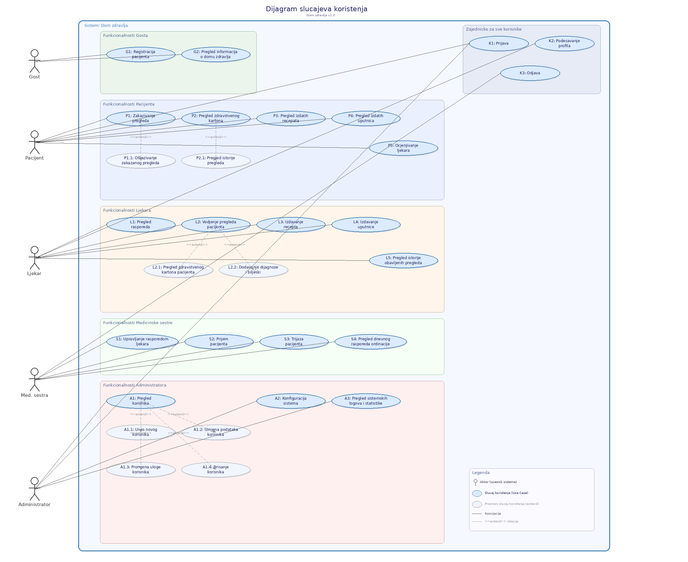

*Slika 2.2.1. Dijagram slučajeva korištenja softverskog sistema*

### 2.3. Karakteristike korisnika

Kao što se vidi iz dijagrama slučajeva korištenja sa slike 2.2.1, web aplikacija će biti korištena od strane pet vrsta korisnika. Korisnici aplikacije su administrator, ljekar, medicinska sestra, pacijent i gost. Za svakog korisnika se uvode ocjene karakteristika. Moguće ocjene su visoko, srednje i nisko. U tabeli 2.3.1. dat je pregled ocjena korisnika web aplikacije.

| **Vrsta korisnika** | **Godine** | **Obrazovanje** | **Iskustvo** | **Tehničko iskustvo** |
| ------------------- | ---------- | --------------- | ------------ | --------------------- |
| Administrator       | 25–50      | visoko          | visoko       | visoko                |
| Ljekar              | 28–65      | visoko          | visoko       | srednje               |
| Medicinska sestra   | 22–60      | srednje/visoko  | srednje      | srednje               |
| Pacijent            | 18–...     | nisko/srednje   | nisko        | nisko                 |
| Gost                | –          | –               | –            | nisko                 |

*Tabela 2.3.1. Karakteristike korisnika*

**Napomene uz karakteristike:**

- **Administrator** — osoba sa visokim tehničkim iskustvom, zadužena za upravljanje sistemom. Očekuje se da je upoznata sa principima administracije web aplikacija.
- **Ljekar** — medicinsko lice sa visokim obrazovanjem, koje koristi sistem za vođenje pregleda i dokumentaciju. Tehnička znanja su na srednjem nivou, jer se očekuje osnovno poznavanje rada na računaru i web aplikacijama.
- **Medicinska sestra** — osoba sa srednjim ili visokim medicinskim obrazovanjem. Koristi sistem za upravljanje rasporedom i prijem pacijenata. Tehničko iskustvo je srednje.
- **Pacijent** — može biti osoba bilo koje dobi (starija od 18 godina, ili zakonski zastupnik za maloljetne). Tehnička znanja variraju, stoga korisnički interfejs mora biti intuitivan i jednostavan za korištenje.
- **Gost** — neregistrovana osoba koja pregleda javno dostupni sadržaj sajta. Nije potrebno nikakvo posebno iskustvo.

### 2.4. Ograničenja

#### Hardverska ograničenja

Server (hosting) treba da ima minimalno:

- prostor za web sajt: 2 GB
- prostor za bazu podataka: 1 GB
- mjesečni saobraćaj HTTP/FTP: neograničen
- hosting domen: 1
- baza podataka: 1
- e-mail adresa: 200
- e-mail memorija: 30 GB
- RAM: 2 GB (preporučeno 4 GB)

S obzirom da sistem čuva medicinske podatke (zdravstvene kartone, recepte, uputnice, dijagnoze), potrebno je osigurati dovoljan prostor za bazu podataka i redovne backup-e. Sistem će koristiti e-mail obavještenja za potvrdu termina, podsjetnike za preglede i obavještenja o izdatim receptima/uputnicama, pa je potrebno da na hardveru bude rezervisano dosta prostora za smještanje e-pošte.

Karakteristike klijentskog računara, tableta ili mobilnog telefona treba da budu takve da je moguća instalacija nekog od sljedećih web pretraživača: Mozilla Firefox, Google Chrome, Opera, Microsoft Edge, Safari.

#### Sigurnost

Gost web sajta može da pregleda osnovne informacije o domu zdravlja (radno vrijeme, kontakt, odjeljenja), ali za bilo koju drugu funkciju potrebno je da se prijavi na web sajt.

Pacijent može da pristupa isključivo svom zdravstvenom kartonu, svojim terminima, receptima i uputnicama. Pacijent ne može vidjeti podatke drugih pacijenata.

Ljekar ima uvid u zdravstveni karton pacijenta koji mu dolazi na pregled, ali ne može pristupiti kartonima pacijenata koji nisu zakazani kod njega (osim u slučaju hitne intervencije, sa odgovarajućim logiranjem).

Medicinska sestra ima uvid u raspored ljekara i osnovne podatke pacijenata koji su zakazani za prijem, ali nema pristup kompletnom zdravstvenom kartonu.

Administrator upravlja korisnicima i konfiguracijom sistema. Jednoj osobi može biti dodijeljeno više uloga, tako da jedna osoba u isto vrijeme može da obavlja ulogu i administratora i ljekara.

Svi podaci o pacijentima i medicinskim pregledima moraju biti zaštićeni u skladu sa Zakonom o zaštiti ličnih podataka u BiH i GDPR principima. Lozinke korisnika se čuvaju u hashiranom obliku. Komunikacija između klijenta i servera odvija se putem HTTPS protokola sa SSL/TLS enkripcijom. Osjetljivi medicinski podaci u bazi podataka moraju biti enkriptovani (AES-256). Sistem mora voditi audit log — evidenciju o svim pristupima medicinskim podacima.

#### Softverska ograničenja

Programski jezici i framework-ovi za izgradnju web aplikacije:

- PHP 8.x (Laravel 10.x framework)
- JavaScript (ES6+)
- HTML5, CSS3 (Bootstrap framework za responzivan dizajn)

Server na kome se izvršava sistem:

- Apache 2.4+ (ili Nginx)

Baza podataka:

- MySQL 8.0+

Dodatni alati:

- Composer — upravljanje PHP zavisnostima
- NPM — upravljanje JavaScript zavisnostima
- Laravel Eloquent ORM — za interakciju sa bazom podataka
- Laravel Mail — za slanje e-mail obavještenja

### 2.5. Raspodjela zahtjeva

U tabeli 2.5.1. prikazani su učesnici i zahtjevi koje učesnici mogu izvršavati unutar sistema.

| **Učesnik** | **Zahtjev** |
| --- | --- |
| **Administrator** | Prijava, Pregled korisnika, Unos novog korisnika (ljekar, medicinska sestra, administrator), Izmjena podataka korisnika, Promjena uloge korisnika, Brisanje korisnika, Konfiguracija sistema (radno vrijeme, odjeljenja, ordinacije), Pregled sistemskih logova i statistike, Podešavanje profila, Odjava |
| **Ljekar** | Prijava, Pregled rasporeda (zakazani pregledi), Vođenje pregleda pacijenta, Pregled zdravstvenog kartona pacijenta, Dodavanje dijagnoze i bilješki, Izdavanje recepta, Izdavanje uputnice, Pregled istorije obavljenih pregleda, Podešavanje profila, Odjava |
| **Medicinska sestra** | Prijava, Upravljanje rasporedom ljekara (kreiranje, izmjena, brisanje termina), Prijem pacijenta, Trijaža pacijenta, Pregled dnevnog rasporeda ordinacije, Pregled liste zakazanih pacijenata, Podešavanje profila, Odjava |
| **Pacijent** | Registracija, Prijava, Zakazivanje pregleda (odabir ljekara i termina), Otkazivanje zakazanog pregleda, Pregled zdravstvenog kartona (dijagnoze, terapije), Pregled istorije pregleda, Pregled izdatih recepata, Pregled izdatih uputnica, Ocjenjivanje ljekara, Podešavanje profila, Odjava |
| **Gost** | Pregled informacija o domu zdravlja (radno vrijeme, kontakt, lokacija), Pregled liste odjeljenja i ljekara, Registracija (prelazak u ulogu pacijenta) |

*Tabela 2.5.1. Raspodjela zahtjeva po učesnicima*

---

## 3. Zahtjevi

### 3.1. Vanjski zahtjevi

#### 3.1.1. Korisnički interfejsi

Mockup korisničkog interfejsa prikazan je u poglavlju 4.3, a ispod odgovarajućih mockup-ova naveden je kratak opis. Svaki mockup prati jedan zahtjev slučaja korištenja prikazanog na slici 2.2.1., odnosno odgovarajući opis slučaja korištenja u poglavlju 3.2.

Korisnik sa sistemom komunicira isključivo upotrebom standardnih komponenti korisničkog interfejsa: dugmad, meniji, padajuće liste, tabele, forme za unos podataka, kalendar za odabir termina, polja za pretragu i slično. Interfejs je responzivan i prilagođen za korištenje na desktop računarima, tabletima i mobilnim telefonima.

Korisnički interfejs je organizovan na sljedeći način:

- **Javni dio sajta (gost):** Početna stranica sa osnovnim informacijama o domu zdravlja (radno vrijeme, lokacija, kontakt), lista odjeljenja i ljekara, te forme za registraciju i prijavu.
- **Dashboard pacijenta:** Kontrolna tabla sa predstojećim terminima, obavještenjima, brzim pristupom zakazivanju pregleda, zdravstvenom kartonu, receptima i uputnicama. Navigacija putem bočnog menija.
- **Dashboard ljekara:** Prikaz dnevnog rasporeda pregleda, lista zakazanih pacijenata, pristup zdravstvenim kartonima, forme za unos dijagnoza, terapija, izdavanje recepata i uputnica.
- **Dashboard medicinske sestre:** Dnevni raspored ordinacije, lista pacijenata za prijem, forma za trijažu, upravljanje terminima ljekara (kalendarski prikaz).
- **Administracija:** Upravljanje korisnicima (tabela sa pretragom i filtriranjem), konfiguracija sistema (radno vrijeme, odjeljenja, ordinacije), sistemski logovi i statistički izvještaji.

Svaka stranica sadrži zaglavlje sa logom doma zdravlja, navigacioni meni prilagođen ulozi prijavljenog korisnika, te podnožje sa kontakt informacijama i linkovima.

#### 3.1.2. Hardverski interfejsi

Za interakciju sa sistemom potrebni su miš (ili touchscreen) i tastatura, a za pregled korisničkog interfejsa potreban je monitor (ili ekran mobilnog uređaja/tableta). Za ljekare i medicinske sestre koji rade u ordinacijama, preporučuje se korištenje desktop računara ili laptopa sa monitorom minimalne rezolucije 1366x768 piksela, radi preglednijeg prikaza zdravstvenih kartona i rasporeda.

#### 3.1.3. Softverski interfejsi

Softver će biti kompatibilan na bilo kom operativnom sistemu (Windows, macOS, Linux, Android, iOS), jer zahtijeva samo web pretraživač. Web aplikacija je razvijena korištenjem standardnih web tehnologija (HTML5, CSS3, JavaScript), pa na web pretraživaču nije potrebno instalirati dodatne dodatke (plugin-ove) radi korištenja aplikacije.

Podržani web pretraživači:

- Google Chrome (verzija 90+)
- Mozilla Firefox (verzija 88+)
- Microsoft Edge (verzija 90+)
- Safari (verzija 14+)
- Opera (verzija 76+)

Na serverskoj strani, aplikacija zahtijeva:

- PHP 8.x runtime okruženje sa Laravel 10.x framework-om
- MySQL 8.0+ server baze podataka
- Apache 2.4+ (ili Nginx) web server
- Composer za upravljanje PHP zavisnostima
- NPM za upravljanje frontend zavisnostima

#### 3.1.4. Komunikacioni interfejsi

Sistem će koristiti sljedeće komunikacione protokole:

- **HTTPS (HTTP over SSL/TLS):** za svu komunikaciju između klijenta (web pretraživača) i servera. Svi podaci koji se prenose — uključujući medicinske podatke, lozinke i lične informacije — šifrovani su putem SSL/TLS certifikata, čime se obezbjeđuje povjerljivost i integritet podataka u skladu sa GDPR zahtjevima.
- **SMTP (Simple Mail Transfer Protocol):** za slanje e-mail obavještenja korisnicima. Sistem šalje automatizovane e-mail poruke u sljedećim situacijama:
  - Potvrda registracije pacijenta (verifikacioni e-mail)
  - Potvrda zakazanog termina
  - Podsjetnik za zakazani pregled (24 sata prije termina)
  - Obavještenje o otkazanom terminu
  - Obavještenje o izdatom receptu ili uputnici
  - Obavještenje o promjeni podataka korisničkog naloga
- **FTP/SFTP:** za prenos datoteka na server (backup baze podataka, ažuriranje aplikacije).

#### 3.1.5. Memorijska ograničenja

Server (hosting) treba da ima minimalno:

- prostor za web sajt: 2 GB
- prostor za bazu podataka: 1 GB (sa mogućnošću proširenja do 5 GB, jer se zdravstveni kartoni, dijagnoze, recepti i uputnice akumuliraju tokom vremena)
- mjesečni saobraćaj HTTP/FTP: neograničen
- memorija za e-mail poštu: 30 GB
- RAM memorija servera: 2 GB (preporučeno 4 GB za optimalne performanse)

Softverski sistem ne bi trebao zauzimati više od 128 MB RAM memorije na klijentskom računaru. Na mobilnim uređajima, aplikacija ne bi trebala zauzimati više od 64 MB RAM memorije.

Backup baze podataka treba da se vrši automatski na dnevnoj bazi, sa čuvanjem posljednjih 30 backup-ova. Prostor potreban za backup-e zavisi od veličine baze, ali treba predvidjeti minimalno 10 GB dodatnog prostora na serveru.

#### 3.1.6. Operacije

Web aplikacija koristi automatizovane operacije za obavještavanje korisnika i održavanje sistema:

**E-mail obavještenja:**

- **Registracija pacijenta:** Nakon što se pacijent registruje, sistem šalje verifikacioni e-mail sa linkom za potvrdu naloga. Vrijeme za verifikaciju je ograničeno na 24 sata.
- **Zakazivanje pregleda:** Kada pacijent zakaže pregled, sistem šalje e-mail potvrdu sa detaljima termina (datum, vrijeme, ime ljekara, ordinacija). Ljekar i medicinska sestra takođe dobijaju obavještenje o novom zakazanom terminu.
- **Podsjetnik za pregled:** Sistem automatski šalje podsjetnik pacijentu 24 sata prije zakazanog pregleda putem e-mail-a.
- **Otkazivanje pregleda:** Ukoliko pacijent otkaže termin, sistem šalje obavještenje ljekaru i medicinskoj sestri da je termin otkazan i da je slot ponovo slobodan.
- **Izdavanje recepta/uputnice:** Kada ljekar izda recept ili uputnicu, pacijent dobija e-mail obavještenje sa osnovnim informacijama (bez detaljnih medicinskih podataka u tijelu e-maila, iz sigurnosnih razloga — pacijent se upućuje da se prijavi na sistem za puni uvid).
- **Promjena podataka korisnika:** Kada administrator promijeni podatke korisničkog naloga, korisnik dobija e-mail sa informacijom o izvršenim promjenama.

**Automatski zadaci (Cron jobs):**

- Dnevni automatski backup baze podataka (svakodnevno u 03:00).
- Čišćenje isteklih, neverifikovanih naloga (starijih od 7 dana).
- Brisanje isteklih sesija korisnika.
- Generisanje dnevnog izvještaja o broju obavljenih pregleda, zakazanih termina i izdatih recepata/uputnica (dostupno administratoru).

### 3.2. Specifični zahtjevi

Napomene:

· Identifikator: Početna slova predstavljaju učesnika, zatim slijedi hijerarhijsko mjesto zahtjeva među ostalim zahtjevima. Sljedeća početna slova predstavljaju učesnike:

A = Administrator

L = Ljekar

S = Medicinska sestra

P = Pacijent

K = Korisnik (zajedničko za sve prijavljene korisnike)

G = Gost

Na primjer:

\- P1 je prvi zahtjev pacijenta.

\- P1.1 je proširenje zahtjeva P1, a izvršava ga pacijent.

\- L2.1 je proširenje zahtjeva L2, a izvršava ga ljekar.

Ako korisnik izvršava neki zahtjev, a ne izvršava njegovo proširenje, onda se to označava pomoću simbola "\_".

---

| Polje | Opis |
|-------|------|
| **Zahtjev:** | Registracija pacijenta |
| **Identifikator:** | G1 |
| **Učesnici:** | Gost |
| **Opis:** | Gost se registruje na web stranicu kako bi postao pacijent i mogao koristiti funkcionalnosti sistema — zakazivanje pregleda, uvid u zdravstveni karton, recepte i uputnice. |
| **Uslovi koji moraju biti zadovoljeni prije izvršavanja:** | Gost ima e-mail adresu i broj osiguranja (JMBG ili broj zdravstvene knjižice). |
| **Glavni tok:** | 1. Gost popunjava formu za registraciju.Gost unosi svoje ime u odgovarajuće polje. 2. Gost unosi svoje prezime u odgovarajuće polje. 3. Gost unosi svoj JMBG u odgovarajuće polje. 4. Gost unosi datum rođenja u odgovarajuće polje. 5. Gost bira spol iz padajuće liste. 6. Gost unosi adresu stanovanja u odgovarajuće polje. 7. Gost unosi broj telefona u odgovarajuće polje. 8. Gost unosi svoj e-mail u odgovarajuće polje. 9. Gost unosi lozinku u odgovarajuće polje. 10. Gost ponovo unosi lozinku u odgovarajuće polje radi provjere da je lozinka prvi put dobro unesena.Gost potvrđuje registraciju klikom na dugme "Registrujte se".Gost dobija verifikacioni e-mail.Gost vrši verifikaciju klikom na link dobijen u verifikacionom e-mail-u. |
| **Alternativni tok:** | 1. Forma nije korektno popunjena.Nije uneseno ime u odgovarajuće polje. 2. Nije uneseno prezime u odgovarajuće polje. 3. Nije unesen JMBG u odgovarajuće polje. 4. JMBG već postoji u sistemu. 5. Nije unesen datum rođenja. 6. Nije odabran spol. 7. Nije unesena adresa stanovanja. 8. Nije unesen broj telefona.1.9.1. Nije unesen e-mail u odgovarajuće polje.1.9.2. Uneseni e-mail već postoji u sistemu.1.10. Nije unesena lozinka u odgovarajuće polje.1.11. Ponovljena lozinka nije ista kao lozinka korisnika.2. Gost odustaje od registracije klikom na dugme "Odustanite".3. E-mail servis nije dostupan.4. Vrijeme za verifikaciju e-mail-a je isteklo (24 sata). |
| **Uslovi koji moraju biti zadovoljeni poslije izvršavanja:** | Gost se uspješno registrovao i postao pacijent u sistemu. |

| Polje | Opis |
|-------|------|
| **Zahtjev:** | Pregled informacija o domu zdravlja |
| **Identifikator:** | G2 |
| **Učesnici:** | Gost |
| **Opis:** | Gost može pregledati javno dostupne informacije o domu zdravlja — radno vrijeme, lokaciju, kontakt podatke, te listu odjeljenja i ljekara. |
| **Uslovi koji moraju biti zadovoljeni prije izvršavanja:** | Gost je posjetio web sajt doma zdravlja. |
| **Glavni tok:** | 1. Gost pregleda početnu stranicu sa osnovnim informacijama (radno vrijeme, adresa, kontakt telefon, e-mail). 2. Gost pregleda listu odjeljenja klikom na link "Odjeljenja" u glavnom meniju. 3. Gost pregleda listu ljekara klikom na link "Ljekari" u glavnom meniju. |
| **Alternativni tok:** | / |
| **Uslovi koji moraju biti zadovoljeni poslije izvršavanja:** | Gostu su prikazane javno dostupne informacije o domu zdravlja. |

| Polje | Opis |
|-------|------|
| **Zahtjev:** | Prijava |
| **Identifikator:** | K1 |
| **Učesnici:** | Korisnik (Pacijent, Ljekar, Medicinska sestra, Administrator) |
| **Opis:** | Korisnik se prijavljuje na sajt kako bi mogao da koristi web aplikaciju u skladu sa svojom ulogom. |
| **Uslovi koji moraju biti zadovoljeni prije izvršavanja:** | Korisnik je registrovan u sistemu (pacijent se sam registrovao, ostale korisnike je dodao administrator). |
| **Glavni tok:** | 1. Korisnik unosi svoj e-mail u odgovarajuće polje. 2. Korisnik unosi svoju lozinku u odgovarajuće polje. 3. Korisnik potvrđuje prijavu klikom na dugme "Prijavite se". 4. Sistem provjerava kredencijale i preusmjerava korisnika na dashboard koji odgovara njegovoj ulozi. |
| **Alternativni tok:** | 1. Uneseni e-mail ne postoji u sistemu. 2. Netačna lozinka. 3. Korisnik odustaje od prijave klikom na dugme "Odustanite". 4. Nalog pacijenta nije verifikovan (e-mail verifikacija nije izvršena). 5. Nalog je deaktiviran od strane administratora. |
| **Uslovi koji moraju biti zadovoljeni poslije izvršavanja:** | Korisnik se uspješno prijavio na sajt i preusmjeren je na odgovarajući dashboard. |

| Polje | Opis |
|-------|------|
| **Zahtjev:** | Podešavanje profila |
| **Identifikator:** | K2 |
| **Učesnici:** | Korisnik (Pacijent, Ljekar, Medicinska sestra, Administrator) |
| **Opis:** | Korisnik može da izvrši promjenu osnovnih podataka ili lozinke. Od osnovnih podataka korisnik može da promijeni adresu stanovanja, broj telefona i profilnu fotografiju. Lozinku korisnik mijenja tako što prvo unosi staru lozinku, zatim novu lozinku i potom ponovno unosi novu lozinku radi potvrde. |
| **Uslovi koji moraju biti zadovoljeni prije izvršavanja:** | Korisnik je prijavljen na sajt i izabrao je da podesi profil klikom na link "Podešavanje profila" iz padajućeg menija "Ime_korisnika". |
| **Glavni tok:** | 1. Korisnik unosi izmjenu u odgovarajuće polje. 2. Korisnik potvrđuje izmjenu odgovarajućeg polja klikom na dugme "Potvrdite". |
| **Alternativni tok:** | 1. Stara lozinka nije tačna (prilikom promjene lozinke). 2. Nova lozinka i ponovljena lozinka se ne podudaraju. 3. Korisnik odustaje od izmjena klikom na dugme "Odustanite". |
| **Uslovi koji moraju biti zadovoljeni poslije izvršavanja:** | Korisnik je izvršio promjene na svom profilu. |

| Polje | Opis |
|-------|------|
| **Zahtjev:** | Odjava |
| **Identifikator:** | K3 |
| **Učesnici:** | Korisnik (Pacijent, Ljekar, Medicinska sestra, Administrator) |
| **Opis:** | Korisnik nakon što završi posjetu web aplikaciji može da se odjavi zbog sigurnosnih razloga, posebno ako koristi dijeljeni računar u ordinaciji ili čekaonici. |
| **Uslovi koji moraju biti zadovoljeni prije izvršavanja:** | Korisnik je prijavljen na sajt. |
| **Glavni tok:** | 1. Korisnik otvara padajući meni klikom na link "Ime_korisnika". 2. Korisnik se odjavljuje klikom na link "Odjava". |
| **Alternativni tok:** | / |
| **Uslovi koji moraju biti zadovoljeni poslije izvršavanja:** | Korisnik se odjavio sa sajta nakon čega mu je prikazana početna stranica web sajta. |

| Polje | Opis |
|-------|------|
| **Zahtjev:** | Zakazivanje pregleda |
| **Identifikator:** | P1 |
| **Učesnici:** | Pacijent |
| **Opis:** | Pacijent zakazuje pregled kod željenog ljekara biranjem dostupnog termina. Sistem prikazuje kalendar sa slobodnim terminima za odabranog ljekara. |
| **Uslovi koji moraju biti zadovoljeni prije izvršavanja:** | Pacijent je prijavljen na sajt. |
| **Glavni tok:** | 1. Pacijent posjećuje stranicu "Zakazivanje pregleda" klikom na link "Zakaži pregled" u bočnom meniju. 2. Pacijent bira odjeljenje iz padajuće liste. 3. Pacijent bira ljekara iz padajuće liste (prikazuju se ljekari odabranog odjeljenja). 4. Pacijent bira datum iz kalendara (prikazuju se samo datumi sa slobodnim terminima). 5. Pacijent bira slobodan termin (sat) iz liste dostupnih termina za odabrani datum. 6. Pacijent unosi kratki opis razloga posjete u odgovarajuće polje (opciono). 7. Pacijent potvrđuje zakazivanje klikom na dugme "Zakaži pregled". 8. Sistem šalje e-mail potvrdu pacijentu sa detaljima termina (datum, vrijeme, ime ljekara, ordinacija). 9. Sistem obavještava ljekara i medicinsku sestru o novom zakazanom terminu. |
| **Alternativni tok:** | 1. Nema dostupnih ljekara u odabranom odjeljenju. 2. Nema slobodnih termina za odabranog ljekara u željenom periodu. 3. Pacijent već ima zakazan termin u isto vrijeme. 4. Pacijent odustaje od zakazivanja klikom na dugme "Odustanite". 5. E-mail servis nije dostupan (termin je ipak zakazan, ali obavještenje nije poslano). |
| **Uslovi koji moraju biti zadovoljeni poslije izvršavanja:** | Pregled je uspješno zakazan i termin je evidentiran u rasporedu ljekara. |

| Polje | Opis |
|-------|------|
| **Zahtjev:** | Otkazivanje zakazanog pregleda |
| **Identifikator:** | P1.1 |
| **Učesnici:** | Pacijent |
| **Opis:** | Pacijent može otkazati zakazani pregled najkasnije 24 sata prije termina. Nakon otkazivanja, termin postaje ponovo slobodan za druge pacijente. |
| **Uslovi koji moraju biti zadovoljeni prije izvršavanja:** | - Pacijent je prijavljen na sajt. - Pacijent ima zakazan pregled koji još nije obavljen. - Do zakazanog termina je preostalo više od 24 sata. |
| **Glavni tok:** | 1. Pacijent posjećuje stranicu "Moji termini" klikom na link "Moji termini" u bočnom meniju. 2. Pacijent pronalazi termin koji želi otkazati u listi zakazanih pregleda. 3. Pacijent klikne na dugme "Otkažite" pored željenog termina. 4. Pacijent potvrđuje otkazivanje klikom na dugme "Da" unutar potvrdnog dijaloga. 5. Sistem šalje e-mail obavještenje ljekaru i medicinskoj sestri o otkazanom terminu. |
| **Alternativni tok:** | 1. Do termina je preostalo manje od 24 sata — otkazivanje nije moguće. 2. Pacijent odustaje od otkazivanja klikom na dugme "Ne" unutar potvrdnog dijaloga. 3. E-mail servis nije dostupan. |
| **Uslovi koji moraju biti zadovoljeni poslije izvršavanja:** | Termin je uspješno otkazan i ponovo je slobodan u rasporedu ljekara. |

| Polje | Opis |
|-------|------|
| **Zahtjev:** | Pregled zdravstvenog kartona |
| **Identifikator:** | P2 |
| **Učesnici:** | Pacijent |
| **Opis:** | Pacijent pregledava svoj zdravstveni karton koji sadrži kompletnu medicinsku istoriju — dijagnoze, terapije, bilješke ljekara, te hronologiju svih obavljenih pregleda. |
| **Uslovi koji moraju biti zadovoljeni prije izvršavanja:** | Pacijent je prijavljen na sajt. |
| **Glavni tok:** | 1. Pacijent posjećuje stranicu "Zdravstveni karton" klikom na link "Moj karton" u bočnom meniju. 2. Pacijent pregleda listu dijagnoza, terapija i bilješki ljekara. 3. Pacijent može filtrirati zapise po datumu, ljekaru ili tipu zapisa (dijagnoza, terapija, bilješka). |
| **Alternativni tok:** | 1. Zdravstveni karton je prazan (pacijent još nema obavljenih pregleda). |
| **Uslovi koji moraju biti zadovoljeni poslije izvršavanja:** | Pacijentu je prikazan njegov zdravstveni karton sa kompletnom medicinskom istorijom. |

| Polje | Opis |
|-------|------|
| **Zahtjev:** | Pregled istorije pregleda |
| **Identifikator:** | P2.1 |
| **Učesnici:** | Pacijent |
| **Opis:** | Pacijent pregledava hronološku listu svih obavljenih pregleda, sa informacijama o datumu, ljekaru, odjeljenju i kratkim opisom dijagnoze. |
| **Uslovi koji moraju biti zadovoljeni prije izvršavanja:** | - Pacijent je prijavljen na sajt. - Pacijent ima najmanje jedan obavljen pregled. |
| **Glavni tok:** | 1. Pacijent posjećuje stranicu "Istorija pregleda" klikom na link "Istorija pregleda" u bočnom meniju. 2. Pacijent pregleda listu obavljenih pregleda sortiranu od najnovijeg ka najstarijem. 3. Pacijent može kliknuti na pojedinačni pregled za detaljan uvid (dijagnoza, terapija, bilješke ljekara). |
| **Alternativni tok:** | 1. Pacijent nema obavljenih pregleda — prikazuje se poruka "Nemate obavljenih pregleda". |
| **Uslovi koji moraju biti zadovoljeni poslije izvršavanja:** | Pacijentu je prikazana kompletna istorija obavljenih pregleda. |

| Polje | Opis |
|-------|------|
| **Zahtjev:** | Pregled izdatih recepata |
| **Identifikator:** | P3 |
| **Učesnici:** | Pacijent |
| **Opis:** | Pacijent pregledava listu svih recepata koji su mu izdati, sa informacijama o nazivu lijeka, dozi, načinu primjene, ljekaru koji je izdao recept, datumu izdavanja i statusu recepta (aktivan/istekao). |
| **Uslovi koji moraju biti zadovoljeni prije izvršavanja:** | - Pacijent je prijavljen na sajt. - Pacijent ima najmanje jedan izdat recept. |
| **Glavni tok:** | 1. Pacijent posjećuje stranicu "Moji recepti" klikom na link "Recepti" u bočnom meniju. 2. Pacijent pregleda listu izdatih recepata. 3. Pacijent može filtrirati recepte po statusu (aktivni/istekli) ili po datumu. 4. Pacijent može kliknuti na pojedinačni recept za detaljan uvid. |
| **Alternativni tok:** | 1. Pacijent nema izdatih recepata — prikazuje se poruka "Nemate izdatih recepata". |
| **Uslovi koji moraju biti zadovoljeni poslije izvršavanja:** | Pacijentu je prikazana kompletna lista izdatih recepata. |

| Polje | Opis |
|-------|------|
| **Zahtjev:** | Pregled izdatih uputnica |
| **Identifikator:** | P4 |
| **Učesnici:** | Pacijent |
| **Opis:** | Pacijent pregledava listu svih uputnica koje su mu izdate, sa informacijama o vrsti specijalističkog pregleda ili dijagnostičke procedure, ljekaru koji je izdao uputnicu, datumu izdavanja, statusu uputnice (aktivna/iskorištena/istekla) i ustanovi na koju je upućen. |
| **Uslovi koji moraju biti zadovoljeni prije izvršavanja:** | - Pacijent je prijavljen na sajt. - Pacijent ima najmanje jednu izdatu uputnicu. |
| **Glavni tok:** | 1. Pacijent posjećuje stranicu "Moje uputnice" klikom na link "Uputnice" u bočnom meniju. 2. Pacijent pregleda listu izdatih uputnica. 3. Pacijent može filtrirati uputnice po statusu (aktivne/iskorištene/istekle) ili po datumu. 4. Pacijent može kliknuti na pojedinačnu uputnicu za detaljan uvid. |
| **Alternativni tok:** | 1. Pacijent nema izdatih uputnica — prikazuje se poruka "Nemate izdatih uputnica". |
| **Uslovi koji moraju biti zadovoljeni poslije izvršavanja:** | Pacijentu je prikazana kompletna lista izdatih uputnica. |

| Polje | Opis |
|-------|------|
| **Zahtjev:** | Ocjenjivanje ljekara |
| **Identifikator:** | P5 |
| **Učesnici:** | Pacijent |
| **Opis:** | Pacijent može ocijeniti ljekara nakon obavljenog pregleda kako bi izrazio svoje zadovoljstvo pruženom uslugom. Ocjena se daje u rasponu od 1 do 5 zvjezdica, uz mogućnost ostavljanja komentara. |
| **Uslovi koji moraju biti zadovoljeni prije izvršavanja:** | - Pacijent je prijavljen na sajt. - Pacijent je obavio pregled kod ljekara kojeg želi ocijeniti. - Pacijent još nije ocijenio ljekara za taj konkretni pregled. |
| **Glavni tok:** | 1. Pacijent posjećuje stranicu "Istorija pregleda". 2. Pacijent pronalazi obavljeni pregled i klikne na dugme "Ocijeni ljekara". 3. Pacijent bira ocjenu klikom na jednu zvjezdicu u rasponu od 1 do 5. 4. Pacijent opciono unosi komentar u odgovarajuće polje. 5. Pacijent potvrđuje ocjenu klikom na dugme "Pošaljite ocjenu". |
| **Alternativni tok:** | 1. Pacijent nije odabrao ocjenu (nijedna zvjezdica nije označena). 2. Komentar sadrži neprimjeren sadržaj. 3. Pacijent odustaje od ocjenjivanja klikom na dugme "Odustanite". |
| **Uslovi koji moraju biti zadovoljeni poslije izvršavanja:** | Pacijent je uspješno ocijenio ljekara za obavljeni pregled. |

| Polje | Opis |
|-------|------|
| **Zahtjev:** | Pregled rasporeda |
| **Identifikator:** | L1 |
| **Učesnici:** | Ljekar |
| **Opis:** | Ljekar pregledava svoj raspored zakazanih pregleda. Raspored je prikazan u kalendarskom obliku sa dnevnim, sedmičnim i mjesečnim prikazom. Za svaki termin prikazano je ime pacijenta, vrijeme i kratki opis razloga posjete. |
| **Uslovi koji moraju biti zadovoljeni prije izvršavanja:** | Ljekar je prijavljen na sajt. |
| **Glavni tok:** | 1. Ljekar posjećuje stranicu "Moj raspored" klikom na link "Raspored" u bočnom meniju. 2. Ljekar pregleda zakazane termine za trenutni dan (podrazumijevani prikaz). 3. Ljekar može prebaciti prikaz na sedmični ili mjesečni klikom na odgovarajuće dugme. 4. Ljekar može kliknuti na pojedinačni termin za prikaz detalja o pacijentu i razlogu posjete. |
| **Alternativni tok:** | 1. Nema zakazanih termina za odabrani period — prikazuje se poruka "Nemate zakazanih pregleda". |
| **Uslovi koji moraju biti zadovoljeni poslije izvršavanja:** | Ljekaru je prikazan raspored zakazanih pregleda. |

| Polje | Opis |
|-------|------|
| **Zahtjev:** | Vođenje pregleda pacijenta |
| **Identifikator:** | L2 |
| **Učesnici:** | Ljekar |
| **Opis:** | Ljekar vodi pregled pacijenta tako što pristupa zdravstvenom kartonu pacijenta, unosi nalaze, postavlja dijagnozu, propisuje terapiju i dodaje bilješke. Ovo je centralni zahtjev sistema za ljekara. |
| **Uslovi koji moraju biti zadovoljeni prije izvršavanja:** | - Ljekar je prijavljen na sajt. - Pacijent ima zakazan termin kod ljekara. - Medicinska sestra je izvršila prijem pacijenta. |
| **Glavni tok:** | 1. Ljekar otvara zakazani termin iz rasporeda klikom na ime pacijenta. 2. Sistem prikazuje zdravstveni karton pacijenta sa kompletnom medicinskom istorijom. 3. Ljekar pregleda prethodne dijagnoze, terapije i bilješke. 4. Ljekar unosi nalaze pregleda u odgovarajuće polje. 5. Ljekar postavlja dijagnozu biranjem iz liste MKB-10 šifara ili ručnim unosom. 6. Ljekar propisuje terapiju u odgovarajuće polje. 7. Ljekar opciono dodaje bilješke. 8. Ljekar završava pregled klikom na dugme "Završi pregled". |
| **Alternativni tok:** | 1. Pacijent se nije pojavio na zakazani termin — ljekar označava termin kao "Neostvaren". 2. Ljekar odustaje od unosa klikom na dugme "Odustanite" (podaci se ne čuvaju). |
| **Uslovi koji moraju biti zadovoljeni poslije izvršavanja:** | Pregled je evidentiran u zdravstvenom kartonu pacijenta sa dijagnozom, terapijom i bilješkama. |

| Polje | Opis |
|-------|------|
| **Zahtjev:** | Pregled zdravstvenog kartona pacijenta |
| **Identifikator:** | L2.1 |
| **Učesnici:** | Ljekar |
| **Opis:** | Ljekar ima potpuni uvid u zdravstveni karton pacijenta koji mu dolazi na pregled. Karton sadrži kompletnu medicinsku istoriju — sve dijagnoze, terapije, bilješke, izdate recepte i uputnice, bez obzira na to koji ljekar ih je unio. |
| **Uslovi koji moraju biti zadovoljeni prije izvršavanja:** | - Ljekar je prijavljen na sajt. - Pacijent ima zakazan termin kod ljekara (ili je u toku pregled). |
| **Glavni tok:** | 1. Ljekar pristupa zdravstvenom kartonu pacijenta iz rasporeda ili tokom vođenja pregleda. 2. Ljekar pregleda kompletnu medicinsku istoriju pacijenta. 3. Ljekar može filtrirati zapise po datumu, tipu zapisa ili ljekaru koji je unio zapis. |
| **Alternativni tok:** | 1. Zdravstveni karton pacijenta je prazan (novi pacijent bez prethodnih pregleda). |
| **Uslovi koji moraju biti zadovoljeni poslije izvršavanja:** | Ljekaru je prikazan kompletan zdravstveni karton pacijenta. |

| Polje | Opis |
|-------|------|
| **Zahtjev:** | Dodavanje dijagnoze i bilješki |
| **Identifikator:** | L2.2 |
| **Učesnici:** | Ljekar |
| **Opis:** | Ljekar dodaje dijagnozu i bilješke u zdravstveni karton pacijenta tokom ili nakon pregleda. Dijagnoza se unosi pomoću MKB-10 klasifikacije (Međunarodna klasifikacija bolesti), a bilješke su slobodan tekst. |
| **Uslovi koji moraju biti zadovoljeni prije izvršavanja:** | - Ljekar je prijavljen na sajt. - Ljekar je pokrenuo vođenje pregleda pacijenta. |
| **Glavni tok:** | 1. Ljekar bira dijagnozu iz padajuće liste MKB-10 šifara ili unosi šifru/naziv ručno u polje za pretragu. 2. Ljekar unosi dodatne bilješke u odgovarajuće polje (slobodan tekst). 3. Ljekar propisuje terapiju u odgovarajuće polje. 4. Ljekar potvrđuje unos klikom na dugme "Sačuvajte". |
| **Alternativni tok:** | 1. Dijagnoza nije odabrana iz MKB-10 liste. 2. Polje za bilješke je prazno (bilješke su opcione — sistem dozvoljava čuvanje bez bilješki). 3. Ljekar odustaje od unosa klikom na dugme "Odustanite". |
| **Uslovi koji moraju biti zadovoljeni poslije izvršavanja:** | Dijagnoza i bilješke su sačuvane u zdravstvenom kartonu pacijenta. |

| Polje | Opis |
|-------|------|
| **Zahtjev:** | Izdavanje recepta |
| **Identifikator:** | L3 |
| **Učesnici:** | Ljekar |
| **Opis:** | Ljekar izdaje elektronski recept za lijekove pacijentu. Recept sadrži naziv lijeka, dozu, način primjene, učestalost, trajanje terapije i posebne napomene. Recept se automatski evidentira u zdravstvenom kartonu pacijenta. |
| **Uslovi koji moraju biti zadovoljeni prije izvršavanja:** | - Ljekar je prijavljen na sajt. - Ljekar je pokrenuo vođenje pregleda pacijenta ili pristupa kartonu pacijenta. |
| **Glavni tok:** | 1. Ljekar klikne na dugme "Izdaj recept" tokom vođenja pregleda ili iz kartona pacijenta. 2. Ljekar popunjava formu za izdavanje recepta.Ljekar bira naziv lijeka iz padajuće liste registrovanih lijekova ili unosi naziv ručno. 3. Ljekar unosi dozu lijeka u odgovarajuće polje (npr. "500 mg"). 4. Ljekar bira način primjene iz padajuće liste (oralno, intravenski, intramuskularno, lokalno, itd.). 5. Ljekar unosi učestalost primjene u odgovarajuće polje (npr. "3 puta dnevno"). 6. Ljekar unosi trajanje terapije u odgovarajuće polje (npr. "7 dana"). 7. Ljekar opciono unosi posebne napomene (npr. "Uzimati nakon jela").Ljekar potvrđuje izdavanje recepta klikom na dugme "Izdaj recept".Sistem evidentira recept u zdravstvenom kartonu pacijenta.Sistem šalje e-mail obavještenje pacijentu o izdatom receptu. |
| **Alternativni tok:** | 1. Forma nije korektno popunjena.Naziv lijeka nije unesen. 2. Doza lijeka nije unesena. 3. Način primjene nije odabran. 4. Učestalost primjene nije unesena. 5. Trajanje terapije nije uneseno.Ljekar odustaje od izdavanja recepta klikom na dugme "Odustanite".E-mail servis nije dostupan. |
| **Uslovi koji moraju biti zadovoljeni poslije izvršavanja:** | Recept je uspješno izdat i evidentiran u zdravstvenom kartonu pacijenta. |

| Polje | Opis |
|-------|------|
| **Zahtjev:** | Izdavanje uputnice |
| **Identifikator:** | L4 |
| **Učesnici:** | Ljekar |
| **Opis:** | Ljekar izdaje elektronsku uputnicu za specijalistički pregled ili dijagnostičku proceduru. Uputnica sadrži vrstu pregleda/procedure, razlog upućivanja, dijagnozu, ustanovu na koju se pacijent upućuje i rok važenja uputnice. |
| **Uslovi koji moraju biti zadovoljeni prije izvršavanja:** | - Ljekar je prijavljen na sajt. - Ljekar je pokrenuo vođenje pregleda pacijenta ili pristupa kartonu pacijenta. |
| **Glavni tok:** | 1. Ljekar klikne na dugme "Izdaj uputnicu" tokom vođenja pregleda ili iz kartona pacijenta. 2. Ljekar popunjava formu za izdavanje uputnice.Ljekar bira vrstu specijalističkog pregleda ili dijagnostičke procedure iz padajuće liste. 3. Ljekar unosi razlog upućivanja u odgovarajuće polje. 4. Ljekar bira dijagnozu (MKB-10 šifru) koja je osnov za upućivanje. 5. Ljekar bira ustanovu na koju se pacijent upućuje iz padajuće liste. 6. Ljekar unosi rok važenja uputnice (podrazumijevano 30 dana). 7. Ljekar opciono unosi dodatne napomene.Ljekar potvrđuje izdavanje uputnice klikom na dugme "Izdaj uputnicu".Sistem evidentira uputnicu u zdravstvenom kartonu pacijenta.Sistem šalje e-mail obavještenje pacijentu o izdatoj uputnici. |
| **Alternativni tok:** | 1. Forma nije korektno popunjena.Vrsta pregleda/procedure nije odabrana. 2. Razlog upućivanja nije unesen. 3. Dijagnoza nije odabrana. 4. Ustanova nije odabrana.Ljekar odustaje od izdavanja uputnice klikom na dugme "Odustanite".E-mail servis nije dostupan. |
| **Uslovi koji moraju biti zadovoljeni poslije izvršavanja:** | Uputnica je uspješno izdata i evidentirana u zdravstvenom kartonu pacijenta. |

| Polje | Opis |
|-------|------|
| **Zahtjev:** | Pregled istorije obavljenih pregleda |
| **Identifikator:** | L5 |
| **Učesnici:** | Ljekar |
| **Opis:** | Ljekar pregledava istoriju svih pregleda koje je obavio. Lista sadrži informacije o datumu, imenu pacijenta, dijagnozi i statusu pregleda. |
| **Uslovi koji moraju biti zadovoljeni prije izvršavanja:** | Ljekar je prijavljen na sajt. |
| **Glavni tok:** | 1. Ljekar posjećuje stranicu "Istorija pregleda" klikom na link "Istorija" u bočnom meniju. 2. Ljekar pregleda listu obavljenih pregleda sortiranu od najnovijeg ka najstarijem. 3. Ljekar može filtrirati preglede po datumu, imenu pacijenta ili dijagnozi. 4. Ljekar može kliknuti na pojedinačni pregled za detaljan uvid. |
| **Alternativni tok:** | 1. Ljekar nema obavljenih pregleda — prikazuje se poruka "Nemate obavljenih pregleda". |
| **Uslovi koji moraju biti zadovoljeni poslije izvršavanja:** | Ljekaru je prikazana kompletna istorija obavljenih pregleda. |

| Polje | Opis |
|-------|------|
| **Zahtjev:** | Upravljanje rasporedom ljekara |
| **Identifikator:** | S1 |
| **Učesnici:** | Medicinska sestra |
| **Opis:** | Medicinska sestra kreira, mijenja i briše termine u rasporedu ljekara. Raspored se prikazuje u kalendarskom obliku. Medicinska sestra može definisati radne sate ljekara, trajanje termina i pauze. |
| **Uslovi koji moraju biti zadovoljeni prije izvršavanja:** | Medicinska sestra je prijavljena na sajt. |
| **Glavni tok:** | 1. Medicinska sestra posjećuje stranicu "Upravljanje rasporedom" klikom na link "Raspored" u bočnom meniju. 2. Medicinska sestra bira ljekara iz padajuće liste. 3. Sistem prikazuje kalendar sa postojećim terminima odabranog ljekara. 4. Medicinska sestra kreira nove termine.Medicinska sestra bira datum u kalendaru. 5. Medicinska sestra definishe početak i kraj radnog vremena za taj dan. 6. Medicinska sestra definishe trajanje jednog termina (npr. 15, 20 ili 30 minuta). 7. Medicinska sestra opciono definishe pauzu (npr. 12:00–12:30).Medicinska sestra potvrđuje kreiranje termina klikom na dugme "Sačuvajte raspored". |
| **Alternativni tok:** | 1. Ljekar nema definisan raspored — kalendar je prazan. 2. Medicinska sestra pokušava obrisati termin koji već ima zakazanog pacijenta — sistem prikazuje upozorenje da je potrebno prvo obavijestiti pacijenta. 3. Medicinska sestra odustaje od izmjena klikom na dugme "Odustanite". |
| **Uslovi koji moraju biti zadovoljeni poslije izvršavanja:** | Raspored ljekara je uspješno ažuriran sa novim terminima. |

| Polje | Opis |
|-------|------|
| **Zahtjev:** | Prijem pacijenta |
| **Identifikator:** | S2 |
| **Učesnici:** | Medicinska sestra |
| **Opis:** | Medicinska sestra vrši prijem pacijenta koji dolazi na zakazani pregled. Prijem uključuje potvrdu dolaska pacijenta i evidentiranje u sistemu da je pacijent stigao. |
| **Uslovi koji moraju biti zadovoljeni prije izvršavanja:** | - Medicinska sestra je prijavljena na sajt. - Pacijent ima zakazan termin za trenutni dan. |
| **Glavni tok:** | 1. Medicinska sestra posjećuje stranicu "Prijem pacijenata" klikom na link "Prijem" u bočnom meniju. 2. Sistem prikazuje listu pacijenata zakazanih za trenutni dan, sa statusom (čeka/primljen/odsutan). 3. Medicinska sestra pronalazi pacijenta u listi. 4. Medicinska sestra klikne na dugme "Primi pacijenta" pored imena pacijenta. 5. Sistem mijenja status pacijenta u "Primljen" i obavještava ljekara da je pacijent stigao. |
| **Alternativni tok:** | 1. Pacijent se nije pojavio — medicinska sestra označava status kao "Odsutan". 2. Nema zakazanih pacijenata za trenutni dan. |
| **Uslovi koji moraju biti zadovoljeni poslije izvršavanja:** | Pacijent je primljen i ljekar je obaviješten o dolasku pacijenta. |

| Polje | Opis |
|-------|------|
| **Zahtjev:** | Trijaža pacijenta |
| **Identifikator:** | S3 |
| **Učesnici:** | Medicinska sestra |
| **Opis:** | Medicinska sestra vrši trijažu pacijenta — procjenu hitnosti stanja i usmjeravanje pacijenta odgovarajućem ljekaru ili odjeljenju. Trijaža je posebno bitna za pacijente koji dolaze bez zakazanog termina (hitni slučajevi). |
| **Uslovi koji moraju biti zadovoljeni prije izvršavanja:** | - Medicinska sestra je prijavljena na sajt. - Pacijent je primljen (ili dolazi bez zakazanog termina). |
| **Glavni tok:** | 1. Medicinska sestra otvara formu za trijažu klikom na dugme "Trijaža" pored imena pacijenta. 2. Medicinska sestra unosi osnovne vitalne znakove (opciono).Krvni pritisak. 3. Tjelesna temperatura. 4. Puls.Medicinska sestra bira kategoriju hitnosti iz padajuće liste (1 — Hitno, 2 — Urgentno, 3 — Manje urgentno, 4 — Neurgentno, 5 — Rutinsko).Medicinska sestra bira ljekara ili odjeljenje na koje usmjerava pacijenta.Medicinska sestra opciono unosi napomenu za ljekara.Medicinska sestra potvrđuje trijažu klikom na dugme "Sačuvajte". |
| **Alternativni tok:** | 1. Kategorija hitnosti nije odabrana. 2. Ljekar ili odjeljenje nije odabrano. 3. Medicinska sestra odustaje od trijaže klikom na dugme "Odustanite". |
| **Uslovi koji moraju biti zadovoljeni poslije izvršavanja:** | Pacijent je triježiran i usmjeren odgovarajućem ljekaru sa evidencijom o kategoriji hitnosti. |

| Polje | Opis |
|-------|------|
| **Zahtjev:** | Pregled dnevnog rasporeda ordinacije |
| **Identifikator:** | S4 |
| **Učesnici:** | Medicinska sestra |
| **Opis:** | Medicinska sestra pregledava dnevni raspored ordinacije sa listom svih zakazanih pacijenata, njihovim statusima (čeka/primljen/u pregledu/završen) i dodijeljenim ljekarima. |
| **Uslovi koji moraju biti zadovoljeni prije izvršavanja:** | Medicinska sestra je prijavljena na sajt. |
| **Glavni tok:** | 1. Medicinska sestra posjećuje stranicu "Dnevni raspored" klikom na link "Dnevni raspored" u bočnom meniju. 2. Sistem prikazuje listu svih termina za trenutni dan sa imenima pacijenata, vremenima, ljekarima i statusima. 3. Medicinska sestra može filtrirati po ljekaru ili statusu termina. |
| **Alternativni tok:** | 1. Nema zakazanih termina za trenutni dan — prikazuje se poruka "Nema zakazanih pregleda za danas". |
| **Uslovi koji moraju biti zadovoljeni poslije izvršavanja:** | Medicinskoj sestri je prikazan kompletan dnevni raspored ordinacije. |

| Polje | Opis |
|-------|------|
| **Zahtjev:** | Pregled korisnika |
| **Identifikator:** | A1 |
| **Učesnici:** | Administrator |
| **Opis:** | Administrator može da pregleda sve korisnike sistema (ljekare, medicinske sestre, pacijente i druge administratore). Prilikom pregleda, administrator može da odluči da doda novog korisnika, izmijeni ili obriše postojećeg. |
| **Uslovi koji moraju biti zadovoljeni prije izvršavanja:** | Administrator je prijavljen na sajt. |
| **Glavni tok:** | 1. Administrator posjećuje stranicu "Pregled korisnika" klikom na link "Korisnici" u bočnom meniju. 2. Sistem prikazuje tabelu sa svim korisnicima sistema (ime, prezime, e-mail, uloga, status). 3. Administrator može pretraživati korisnike po imenu, prezimenu ili e-mail-u. 4. Administrator može filtrirati korisnike po ulozi (ljekar, medicinska sestra, pacijent, administrator). |
| **Alternativni tok:** | / |
| **Uslovi koji moraju biti zadovoljeni poslije izvršavanja:** | Administratoru su prikazani svi korisnici sistema. |

| Polje | Opis |
|-------|------|
| **Zahtjev:** | Unos novog korisnika |
| **Identifikator:** | A1.1 |
| **Učesnici:** | Administrator |
| **Opis:** | Administrator unosi nove korisnike u sistem (ljekare, medicinske sestre, druge administratore) kako bi mogli koristiti funkcionalnosti web aplikacije. Pacijenti se registruju sami putem forme za registraciju. |
| **Uslovi koji moraju biti zadovoljeni prije izvršavanja:** | Administrator je pri pregledu korisnika odabrao unos novog korisnika klikom na dugme "Dodaj korisnika". |
| **Glavni tok:** | 1. Administrator popunjava formu za unos novog korisnika.Administrator unosi korisnikovo ime u odgovarajuće polje. 2. Administrator unosi korisnikovo prezime u odgovarajuće polje. 3. Administrator unosi korisnikov e-mail u odgovarajuće polje. 4. Administrator dodjeljuje ulogu korisniku iz padajuće liste (ljekar, medicinska sestra, administrator). 5. Administrator bira odjeljenje kome korisnik pripada (za ljekare i medicinske sestre). 6. Administrator bira specijalizaciju (za ljekare) iz padajuće liste. 7. Administrator unosi lozinku u odgovarajuće polje. 8. Administrator ponovo unosi lozinku u odgovarajuće polje radi potvrde. 9. Administrator opciono dodaje fotografiju korisnika.Administrator unosi novog korisnika u sistem klikom na dugme "Sačuvajte".Korisnik dobija na e-mail poruku da je postao korisnik web aplikacije zajedno sa pristupnim podacima (e-mail i privremena lozinka). |
| **Alternativni tok:** | 1. Forma nije korektno popunjena.Ime korisnika nije uneseno. 2. Prezime korisnika nije uneseno. 3. E-mail korisnika nije unesen. 4. E-mail već postoji u sistemu. 5. Uloga korisnika nije odabrana. 6. Odjeljenje nije odabrano (za ljekare i medicinske sestre). 7. Lozinka nije unesena. 8. Ponovljena lozinka nije ista kao lozinka.1.9. Fotografija je prevelika (veća od 2MB).2. Administrator odustaje od unosa novog korisnika klikom na dugme "Odustanite".3. E-mail servis nije dostupan. |
| **Uslovi koji moraju biti zadovoljeni poslije izvršavanja:** | Novi korisnik je uspješno dodan u sistem. |

| Polje | Opis |
|-------|------|
| **Zahtjev:** | Izmjena podataka korisnika |
| **Identifikator:** | A1.2 |
| **Učesnici:** | Administrator |
| **Opis:** | Administrator može da izvrši promjenu imena, prezimena, uloge, odjeljenja, specijalizacije i fotografije korisnika. Administrator može i resetovati lozinku korisnika. |
| **Uslovi koji moraju biti zadovoljeni prije izvršavanja:** | Administrator je pri pregledu korisnika odabrao izmjenu određenog korisnika klikom na dugme "Izmijenite". |
| **Glavni tok:** | 1. Administrator unosi izmjenu u odgovarajuće polje. 2. Administrator potvrđuje izmjenu klikom na dugme "Sačuvajte". 3. Korisnik čiji su podaci promijenjeni biva obavješten o promjeni putem e-mail-a. |
| **Alternativni tok:** | 1. Administrator odustaje od izmjena klikom na dugme "Odustanite". 2. E-mail servis nije dostupan. |
| **Uslovi koji moraju biti zadovoljeni poslije izvršavanja:** | Administrator je uspješno izmijenio podatke korisnika. |

| Polje | Opis |
|-------|------|
| **Zahtjev:** | Promjena uloge korisnika |
| **Identifikator:** | A1.3 |
| **Učesnici:** | Administrator |
| **Opis:** | Administrator može promijeniti ulogu korisnika u sistemu. Jednom korisniku može biti dodijeljeno više uloga istovremeno (npr. osoba može biti i ljekar i administrator). |
| **Uslovi koji moraju biti zadovoljeni prije izvršavanja:** | Administrator je pri pregledu korisnika odabrao promjenu uloge korisnika klikom na dugme "Promijeni ulogu". |
| **Glavni tok:** | 1. Sistem prikazuje trenutne uloge korisnika. 2. Administrator dodaje ili uklanja uloge korištenjem checkbox-ova. 3. Administrator potvrđuje promjenu klikom na dugme "Sačuvajte". 4. Korisnik dobija e-mail obavještenje o promjeni uloge. |
| **Alternativni tok:** | 1. Korisnik mora imati barem jednu ulogu — sistem ne dozvoljava uklanjanje svih uloga. 2. Administrator odustaje od promjene klikom na dugme "Odustanite". 3. E-mail servis nije dostupan. |
| **Uslovi koji moraju biti zadovoljeni poslije izvršavanja:** | Uloga korisnika je uspješno promijenjena. |

| Polje | Opis |
|-------|------|
| **Zahtjev:** | Brisanje korisnika |
| **Identifikator:** | A1.4 |
| **Učesnici:** | Administrator |
| **Opis:** | Brisanje korisnika iz sistema. Brisanje je logičko (soft delete) — korisnički nalog se deaktivira, ali podaci ostaju u bazi radi čuvanja medicinske dokumentacije. - Ako se deaktivira ljekar, svi njegovi budući zakazani termini moraju biti preraspoređeni ili otkazani. - Ako se deaktivira medicinska sestra, njene obaveze se moraju preraspodijeliti. |
| **Uslovi koji moraju biti zadovoljeni prije izvršavanja:** | - Korisnik kojeg treba obrisati postoji u sistemu. - Administratoru su pri pregledu korisnika prikazani svi korisnici. |
| **Glavni tok:** | 1. Administrator pronalazi korisnika u tabeli korisnika. 2. Administrator klikne na dugme "Obrišite" pored korisnika. 3. Administrator potvrđuje brisanje klikom na dugme "Da" unutar potvrdnog dijaloga. 4. Sistem deaktivira korisnički nalog (logičko brisanje). 5. Korisnik dobija e-mail obavještenje da je njegov nalog deaktiviran. |
| **Alternativni tok:** | 1. Administrator pokušava obrisati jedini preostali administratorski nalog — sistem to ne dozvoljava. 2. Administrator odustaje od brisanja klikom na dugme "Ne" unutar potvrdnog dijaloga. 3. E-mail servis nije dostupan. |
| **Uslovi koji moraju biti zadovoljeni poslije izvršavanja:** | Korisnički nalog je uspješno deaktiviran. |

| Polje | Opis |
|-------|------|
| **Zahtjev:** | Konfiguracija sistema |
| **Identifikator:** | A2 |
| **Učesnici:** | Administrator |
| **Opis:** | Administrator konfiguriše osnovne parametre sistema — radno vrijeme doma zdravlja, odjeljenja, ordinacije, specijalnosti ljekara i trajanje standardnog termina. Ove postavke utiču na rad čitavog sistema. |
| **Uslovi koji moraju biti zadovoljeni prije izvršavanja:** | Administrator je prijavljen na sajt. |
| **Glavni tok:** | 1. Administrator posjećuje stranicu "Konfiguracija" klikom na link "Konfiguracija" u bočnom meniju. 2. Administrator može izvršiti sljedeće:Postaviti ili izmijeniti radno vrijeme doma zdravlja (za svaki dan u sedmici). 3. Dodati novo odjeljenje (naziv, opis, lokacija). 4. Izmijeniti ili obrisati postojeće odjeljenje. 5. Dodati novu ordinaciju (naziv, odjeljenje, kapacitet). 6. Izmijeniti ili obrisati postojeću ordinaciju. 7. Dodati novu specijalnost ljekara. 8. Postaviti podrazumijevano trajanje termina (15, 20 ili 30 minuta).Administrator potvrđuje izmjene klikom na dugme "Sačuvajte". |
| **Alternativni tok:** | 1. Administrator pokušava obrisati odjeljenje koje ima aktivne ljekare — sistem prikazuje upozorenje. 2. Administrator odustaje od izmjena klikom na dugme "Odustanite". |
| **Uslovi koji moraju biti zadovoljeni poslije izvršavanja:** | Konfiguracija sistema je uspješno ažurirana. |

| Polje | Opis |
|-------|------|
| **Zahtjev:** | Pregled sistemskih logova i statistike |
| **Identifikator:** | A3 |
| **Učesnici:** | Administrator |
| **Opis:** | Administrator pregledava sistemske logove (evidencija pristupa, promjene podataka, greške) i statističke izvještaje o radu doma zdravlja (broj pregleda, zakazanih termina, izdatih recepata, uputnica, aktivnih korisnika). |
| **Uslovi koji moraju biti zadovoljeni prije izvršavanja:** | Administrator je prijavljen na sajt. |
| **Glavni tok:** | 1. Administrator posjećuje stranicu "Logovi i statistika" klikom na link "Izvještaji" u bočnom meniju. 2. Administrator bira vrstu izvještaja:Sistemski logovi (pristup, promjene podataka, greške). 3. Statistika pregleda (dnevna, sedmična, mjesečna). 4. Statistika korisnika (aktivni, novi registrovani). 5. Statistika recepata i uputnica.Administrator može filtrirati izvještaje po datumskom rasponu.Administrator može eksportovati izvještaj u PDF ili CSV format klikom na dugme "Eksportuj". |
| **Alternativni tok:** | 1. Nema podataka za odabrani period — prikazuje se poruka "Nema podataka za odabrani period". |
| **Uslovi koji moraju biti zadovoljeni poslije izvršavanja:** | Administratoru su prikazani traženi logovi ili statistički izvještaji. |

#### 3.2.1. Dijagrami sekvenci i aktivnosti

U ovom poglavlju su prikazani dijagrami sekvenci i dijagrami aktivnosti za ključne funkcionalnosti sistema *Dom zdravlja*. Dijagrami sekvenci ilustruju interakciju između učesnika i sistema tokom izvršavanja određenog zahtjeva, dok dijagrami aktivnosti prikazuju tok aktivnosti i odluka unutar pojedinih procesa.

##### Dijagrami sekvenci

**G1: Registracija pacijenta**

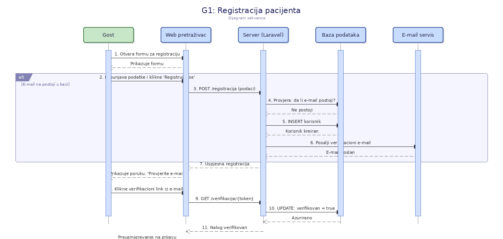

*Slika 3.2.1.1. Dijagram sekvence za registraciju pacijenta (G1)*

---

**K1: Prijava korisnika**

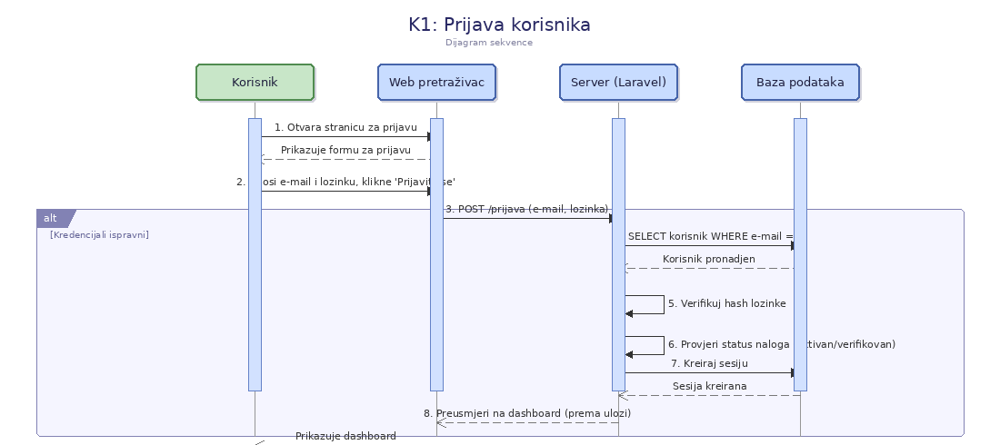

*Slika 3.2.1.2. Dijagram sekvence za prijavu korisnika (K1)*

---

**P1: Zakazivanje pregleda**

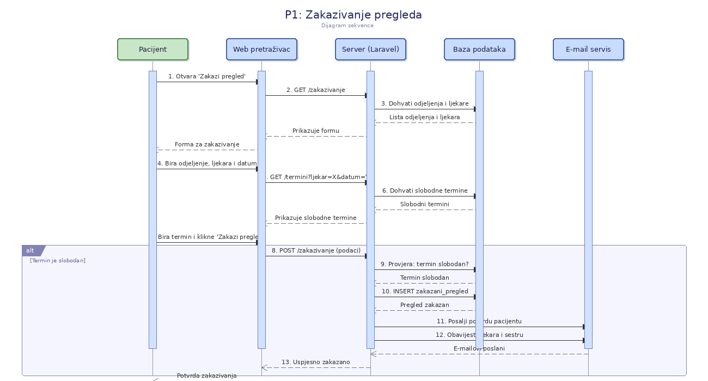

*Slika 3.2.1.3. Dijagram sekvence za zakazivanje pregleda (P1)*

---

**L2: Vođenje pregleda pacijenta**

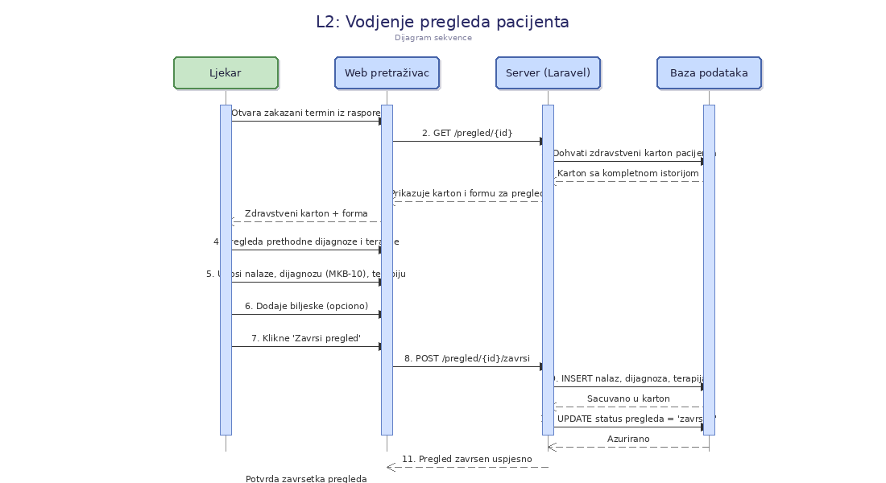

*Slika 3.2.1.4. Dijagram sekvence za vođenje pregleda pacijenta (L2)*

---

**L3: Izdavanje recepta**

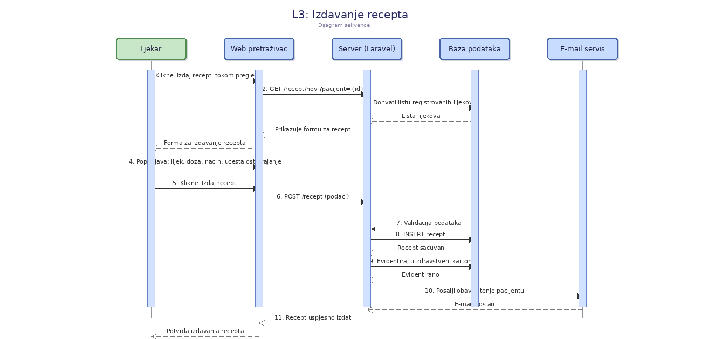

*Slika 3.2.1.5. Dijagram sekvence za izdavanje recepta (L3)*

---

**S1: Upravljanje rasporedom ljekara**

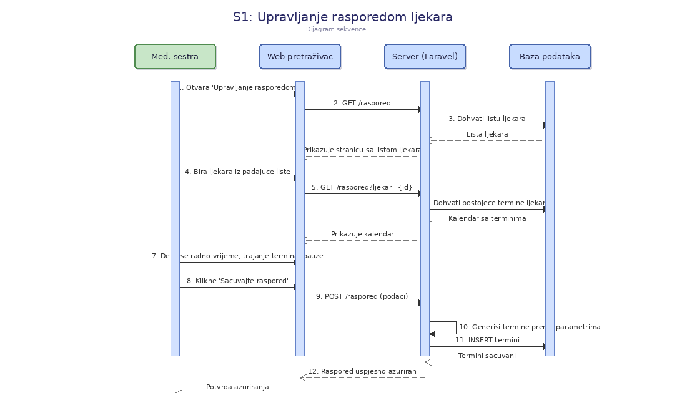

*Slika 3.2.1.6. Dijagram sekvence za upravljanje rasporedom ljekara (S1)*

---

**S2: Prijem pacijenta**

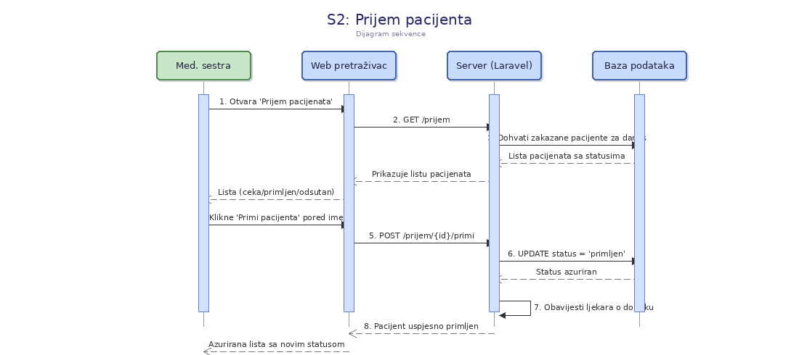

*Slika 3.2.1.7. Dijagram sekvence za prijem pacijenta (S2)*

---

**A1.1: Unos novog korisnika**

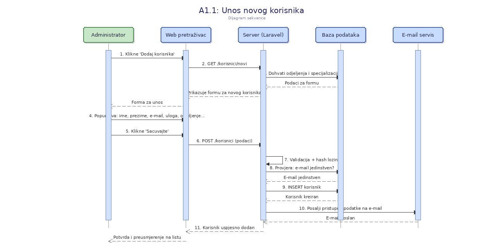

*Slika 3.2.1.8. Dijagram sekvence za unos novog korisnika (A1.1)*

---

##### Dijagrami aktivnosti

**G1: Registracija pacijenta**

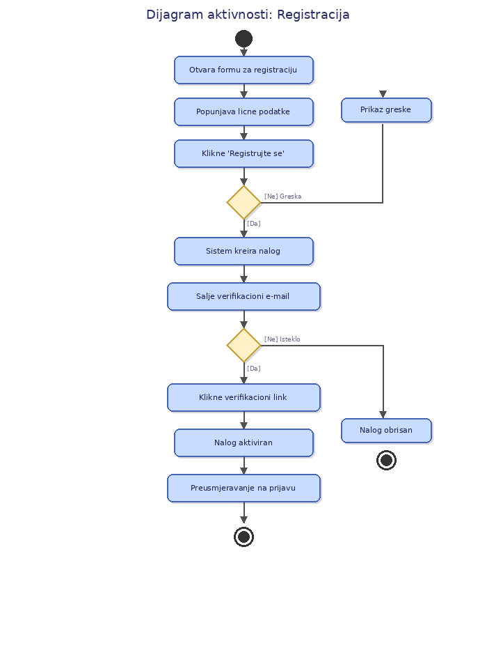

*Slika 3.2.1.9. Dijagram aktivnosti za registraciju pacijenta (G1)*

---

**K1: Prijava korisnika**

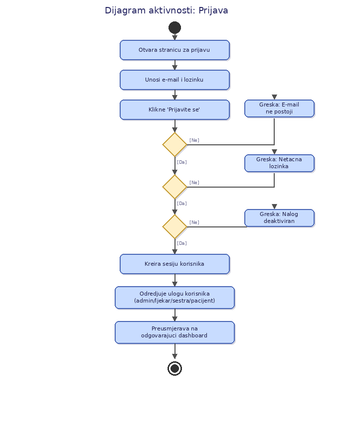

*Slika 3.2.1.10. Dijagram aktivnosti za prijavu korisnika (K1)*

---

**P1: Zakazivanje pregleda**

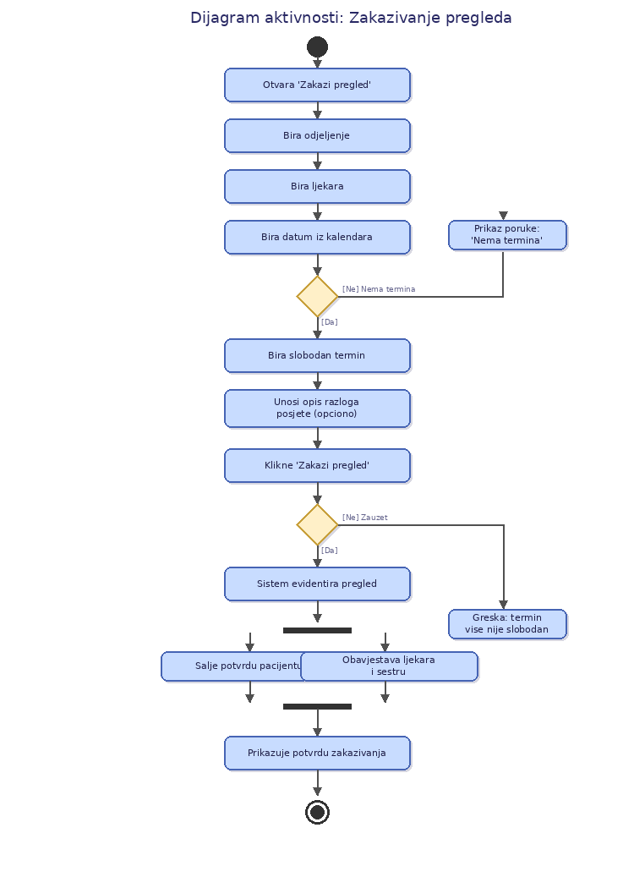

*Slika 3.2.1.11. Dijagram aktivnosti za zakazivanje pregleda (P1)*

---

**L2: Vođenje pregleda pacijenta**

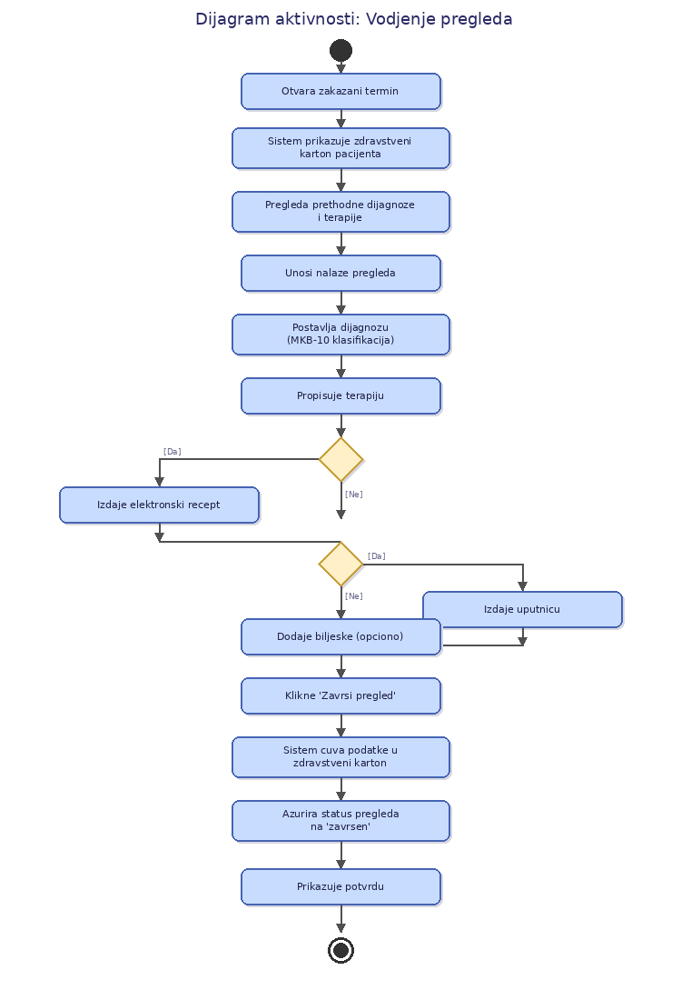

*Slika 3.2.1.12. Dijagram aktivnosti za vođenje pregleda pacijenta (L2)*

---

**L3: Izdavanje recepta**

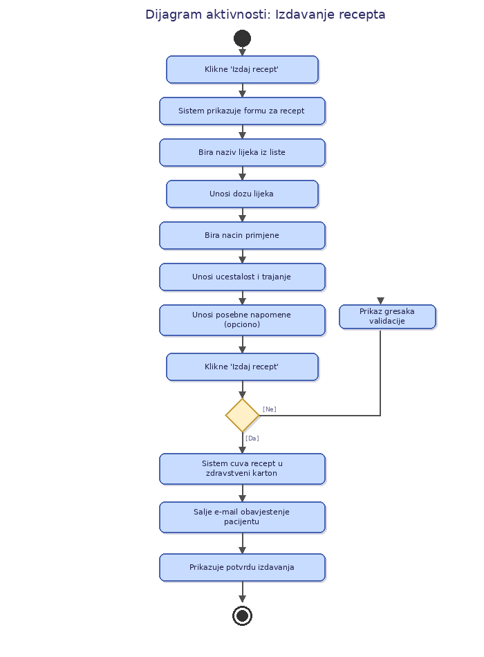

*Slika 3.2.1.13. Dijagram aktivnosti za izdavanje recepta (L3)*

---

### 3.3. Potrebne performanse

#### 3.3.1. Vremenske performanse

Sistem mora da obezbijedi sljedeće vremenske performanse kako bi korisnici imali ugodno i efikasno iskustvo korištenja:

**Odziv korisničkog interfejsa:**

- Učitavanje bilo koje stranice web aplikacije (dashboard, raspored, karton, forme) ne smije trajati duže od **2 sekunde** pri stabilnoj internet konekciji (minimalno 5 Mbps).
- Učitavanje početne (javne) stranice sajta ne smije trajati duže od **1,5 sekundi**.
- Prikaz rezultata pretrage korisnika, pregleda, recepata ili uputnica ne smije trajati duže od **2 sekunde** za do 10.000 zapisa u bazi.

**Operacije sa bazom podataka:**

- Zakazivanje pregleda (uključujući provjeru dostupnosti termina i evidenciju u bazu) mora biti izvršeno u roku od **1 sekunde**.
- Dohvatanje zdravstvenog kartona pacijenta sa kompletnom medicinskom istorijom (do 500 zapisa) ne smije trajati duže od **2 sekunde**.
- Kreiranje novog korisnika u sistemu ne smije trajati duže od **1 sekunde**.
- Izdavanje recepta ili uputnice (uključujući evidenciju u karton) mora biti izvršeno u roku od **1 sekunde**.
- Generisanje rasporeda ljekara (kreiranje termina za sedmicu) ne smije trajati duže od **3 sekunde**.

**E-mail obavještenja:**

- Verifikacioni e-mail nakon registracije pacijenta treba biti poslan u roku od **30 sekundi** od završetka registracije.
- E-mail potvrda zakazanog termina treba biti poslana u roku od **1 minuta**.
- Podsjetnik za zakazani pregled (24 sata prije termina) treba biti poslan u okviru vremenskog prozora od **1 sata** (tj. između 23 i 25 sati prije termina).
- E-mail obavještenje o izdatom receptu ili uputnici treba biti poslano u roku od **2 minuta**.

**Poslovni procesi:**

- Prijem pacijenta (promjena statusa iz "čeka" u "primljen") mora biti izvršen u roku od **1 sekunde**, a obavještenje ljekaru mora stići odmah na dashboard (real-time ili unutar 5 sekundi).
- Trijaža pacijenta (evidentiranje vitalnih znakova i kategorije hitnosti) mora biti sačuvana u roku od **1 sekunde**.
- Generisanje statističkih izvještaja (dnevni, sedmični, mjesečni) ne smije trajati duže od **5 sekundi**.
- Eksportovanje izvještaja u PDF ili CSV format ne smije trajati duže od **10 sekundi** za izvještaje koji pokrivaju period do jedne godine.

**Istovremeni korisnici:**

- Sistem mora podržavati minimalno **50 istovremenih korisnika** bez degradacije performansi iznad navedenih vrijednosti.
- U periodu vršnog opterećenja (jutarnji sati zakazivanja pregleda, 08:00–10:00), sistem mora podržati do **100 istovremenih korisnika** sa maksimalnim odzivom od **3 sekunde** po stranici.

**Automatski zadaci (Cron jobs):**

- Dnevni backup baze podataka (u 03:00) ne smije trajati duže od **15 minuta** za bazu veličine do 5 GB.
- Čišćenje isteklih, neverifikovanih naloga ne smije trajati duže od **1 minut**.
- Generisanje dnevnog izvještaja ne smije trajati duže od **5 minuta**.

#### 3.3.2. Prostorne performanse

**Serverski resursi:**

- Web aplikacija (izvorni kod, framework, zavisnosti, statički resursi) ne smije zauzimati više od **2 GB** prostora na serveru.
- Baza podataka za 10.000 registrovanih pacijenata, 50 ljekara i 30 medicinskih sestara, sa prosječno 5 pregleda godišnje po pacijentu (uključujući kartone, dijagnoze, recepte i uputnice), ne bi trebala premašiti **1 GB** u prvoj godini rada. Predviđeni rast baze je do **500 MB godišnje**.
- Prostor za backup-e (30 dnevnih kopija) ne bi trebao premašiti **15 GB** za prvu godinu rada.
- Log fajlovi sistema (audit log, pristup, greške) ne bi trebali premašiti **500 MB** mjesečno, uz automatsku rotaciju i arhiviranje starijih od 90 dana.
- Prostor za e-mail komunikaciju (SMTP outbox, šabloni obavještenja) ne bi trebao premašiti **100 MB**.

**Klijentski resursi:**

- Web aplikacija ne bi trebala zauzimati više od **128 MB** RAM memorije na desktop računaru korisnika.
- Na mobilnim uređajima i tabletima, aplikacija ne bi trebala zauzimati više od **64 MB** RAM memorije.
- Veličina pojedinačne učitane stranice (HTML, CSS, JS, slike) ne bi trebala premašiti **3 MB**, a idealno bi trebala biti ispod **1,5 MB** radi brzog učitavanja na sporijim konekcijama.
- Profilna fotografija korisnika ne smije biti veća od **2 MB**. Sistem automatski kompresuje fotografije pri uploadu.

**Ograničenja veličine podataka:**

- Tekstualna polja za bilješke ljekara, razlog posjete i napomene ograničena su na **5.000 karaktera** po zapisu.
- Maksimalan broj recepata koji se mogu izdati u jednom pregledu: **10**.
- Maksimalan broj uputnica koje se mogu izdati u jednom pregledu: **5**.
- Maksimalan broj zakazanih termina po pacijentu u jednom danu: **2** (kako bi se spriječilo zloupotrebe sistema).
- Sistem čuva kompletnu medicinsku dokumentaciju bez vremenskog ograničenja (u skladu sa Zakonom o zdravstvenoj zaštiti), ali se stariji podaci (stariji od 5 godina) mogu arhivirati na sekundarno skladište.

---

### 3.4. Dizajn sistema

Dizajn sistema treba biti objektno orijentisan.

- Sistem će biti implementiran korištenjem **Laravel 10.x** (PHP Framework) na serverskoj strani, uz **Blade** šablonski engine za generisanje pogleda i **Eloquent ORM** za interakciju sa bazom podataka.
- Klijentska strana će koristiti **HTML5**, **CSS3** (Bootstrap 5 framework za responzivan dizajn) i **JavaScript** (ES6+) za interaktivnost.
- GUI sistema će biti izgrađen kao **web aplikacija** sa responzivnim dizajnom prilagođenim za desktop, tablet i mobilne uređaje.
- Sav serverski kod će biti napisan u **PHP 8.x**, a klijentski kod u **JavaScript-u**.
- Relaciona baza podataka će biti **MySQL 8.0+**.
- Web server: **Apache 2.4+** (ili Nginx) sa **HTTPS** konfiguracijom.
- Arhitektura aplikacije prati **MVC (Model-View-Controller)** obrazac koji je ugrađen u Laravel framework.
- Za autentifikaciju korisnika koristi se **Laravel Sanctum** (token-based autentifikacija za API) i session-based autentifikacija za web interfejs.
- Za slanje e-mail obavještenja koristi se **Laravel Mail** sa podrškom za queue (asinkrono slanje).
- Za zakazane zadatke (podsjetnici, backup, čišćenje) koristi se **Laravel Task Scheduling** (Cron).

#### 3.4.1. Dijagram klasa

Dijagram klasa prikazuje strukturu sistema sa svim entitetima (klasama), njihovim atributima, metodama i međusobnim relacijama. Dizajn je zasnovan na objektno orijentisanom pristupu sa nasljeđivanjem (apstraktna klasa `Korisnik` kao bazna klasa za sve tipove korisnika) i kompozicijom (zdravstveni karton sadrži preglede, pregledi sadrže recepte i uputnice).

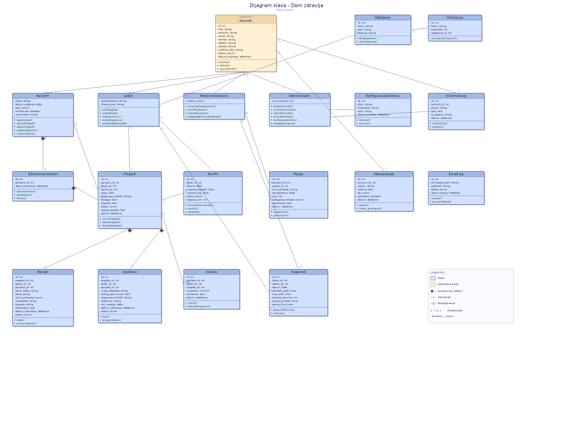

*Slika 3.4.1.1. Dijagram klasa softverskog sistema Dom zdravlja*

**Opis ključnih klasa:**

| Klasa | Opis |
|-------|------|
| **Korisnik** *(abstract)* | Bazna apstraktna klasa za sve korisnike sistema. Sadrži zajedničke atribute (id, ime, prezime, email, lozinka, telefon, adresa, status) i metode (prijava, odjava, ažuriranje profila). |
| **Pacijent** | Nasljeđuje klasu Korisnik. Dodaje specifične atribute (JMBG, datum rođenja, spol, verifikacija) i metode za zakazivanje/otkazivanje pregleda, pregled kartona i ocjenjivanje ljekara. |
| **Ljekar** | Nasljeđuje klasu Korisnik. Dodaje atribute za specijalizaciju i broj licence. Metode obuhvataju vođenje pregleda, izdavanje recepata i uputnica, te dodavanje dijagnoza. |
| **MedicinskaSestra** | Nasljeđuje klasu Korisnik. Dodaje atribut za smjenu. Metode uključuju upravljanje rasporedom, prijem pacijenata i trijažu. |
| **Administrator** | Nasljeđuje klasu Korisnik. Dodaje nivo pristupa. Metode obuhvataju upravljanje korisnicima, konfiguraciju sistema i pregled logova. |
| **ZdravstveniKarton** | Centralni entitet medicinske dokumentacije, vezan za jednog pacijenta (1:1). Sadrži kompletnu medicinsku istoriju. |
| **Pregled** | Evidentira pojedinačni medicinski pregled sa nalazom, dijagnozom (MKB-10), terapijom i bilješkama. Povezan sa pacijentom, ljekarom i terminom. |
| **Termin** | Vremenski slot u rasporedu ljekara. Sadrži datum, vrijeme početka i kraja, te status (slobodan, zauzet, završen). |
| **Recept** | Elektronski recept sa podacima o lijeku, dozi, načinu primjene, učestalosti i trajanju terapije. Vezan za pregled (kompozicija). |
| **Uputnica** | Elektronska uputnica za specijalistički pregled sa vrstom pregleda, razlogom upućivanja, ustanovom i rokom važenja. Vezana za pregled (kompozicija). |
| **Ocjena** | Pacijentova ocjena ljekara (1-5 zvjezdica + komentar) nakon obavljenog pregleda. Relacija 0..1 prema pregledu. |
| **Trijaza** | Evidentira vitalne znakove (pritisak, temperatura, puls), kategoriju hitnosti i usmjeravanje pacijenta. |
| **Raspored** | Definiše radno vrijeme ljekara (početak, kraj, trajanje termina, pauze). Kreira se od strane medicinske sestre. |
| **KonfiguracijaSistema** | Ključ-vrijednost parovi za sistemske parametre (radno vrijeme doma zdravlja, odjeljenja, trajanje termina). |
| **SistemskiLog** | Audit log — evidencija svih akcija u sistemu (pristup, promjene podataka, greške) sa IP adresom i vremenom. |
| **Obavjestenje** | Interna obavještenja korisnicima (novi termin, otkazivanje, recept izdat, itd.). |
| **EmailLog** | Evidencija svih poslanih e-mail poruka sa statusom isporuke. |
| **Odjeljenje** | Organizaciona jedinica doma zdravlja (naziv, opis, lokacija). Povezana sa ljekarima (1:*). |
| **Ordinacija** | Fizički prostor za preglede, pripada odjeljenju (1:*). |

**Ključne relacije:**

| Relacija | Tip | Multiplicitet | Opis |
|----------|-----|---------------|------|
| Korisnik → Pacijent/Ljekar/Sestra/Admin | Nasljeđivanje | — | Svi korisnici nasljeđuju baznu klasu Korisnik. |
| Pacijent ↔ ZdravstveniKarton | Kompozicija | 1 : 1 | Svaki pacijent ima tačno jedan zdravstveni karton. |
| ZdravstveniKarton ↔ Pregled | Kompozicija | 1 : * | Karton sadrži 0 ili više pregleda. |
| Pregled ↔ Recept | Kompozicija | 1 : * | Jedan pregled može rezultirati 0 ili više recepata. |
| Pregled ↔ Uputnica | Kompozicija | 1 : * | Jedan pregled može rezultirati 0 ili više uputnica. |
| Pregled ↔ Ocjena | Asocijacija | 1 : 0..1 | Pregled može imati opciono jednu ocjenu. |
| Pregled ↔ Termin | Asocijacija | 1 : 1 | Svaki pregled je vezan za jedan termin. |
| Ljekar ↔ Termin | Asocijacija | 1 : * | Ljekar ima više termina u rasporedu. |
| Ljekar ↔ Odjeljenje | Asocijacija | * : 1 | Više ljekara pripada jednom odjeljenju. |
| Odjeljenje ↔ Ordinacija | Asocijacija | 1 : * | Odjeljenje ima jednu ili više ordinacija. |
| MedicinskaSestra ↔ Raspored | Asocijacija | 1 : * | Sestra kreira rasporede za ljekare. |
| Ljekar ↔ Raspored | Asocijacija | 1 : * | Ljekar ima definisane rasporede. |
| MedicinskaSestra ↔ Trijaza | Asocijacija | 1 : * | Sestra vrši trijaže pacijenata. |
| Korisnik ↔ Obavjestenje | Asocijacija | 1 : * | Korisnik prima obavještenja. |
| Korisnik ↔ SistemskiLog | Asocijacija | 1 : * | Akcije korisnika se logiraju. |

#### 3.4.2. Dijagrami stanja

Dijagrami stanja prikazuju životni ciklus ključnih entiteta sistema — kroz koja stanja prolaze i koji događaji uzrokuju prelaze između stanja.

---

**Status pregleda**

Pregled prolazi kroz sljedeća stanja: *Zakazan* → *Primljen* → *U toku* → *Završen*. Iz stanja *Zakazan* može preći u *Otkazan* (ako pacijent otkaže >24h prije termina), a iz stanja *Primljen* može preći u *Neostvaren* (ako se pacijent ne pojavi).

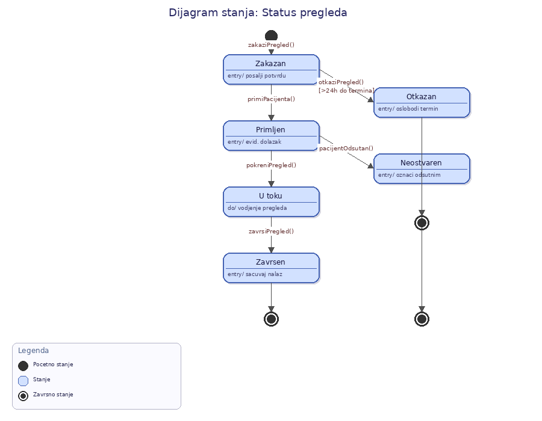

*Slika 3.4.2.1. Dijagram stanja za entitet Pregled*

---

**Status recepta**

Recept prolazi kroz stanja: *Izdat* → *Aktivan* → *Iskorišten*. Iz stanja *Aktivan* može preći u *Istekao* ako prođe rok važenja.

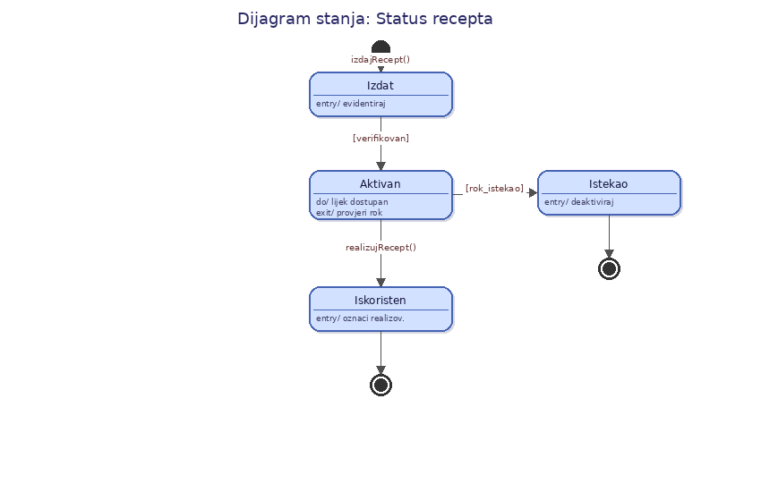

*Slika 3.4.2.2. Dijagram stanja za entitet Recept*

---

**Status uputnice**

Uputnica prolazi kroz stanja: *Izdata* → *Aktivna* → *Iskorištena*. Iz stanja *Aktivna* može preći u *Istekla* (rok prošao) ili *Odbijena* (specijalistička ustanova odbila uputnicu).

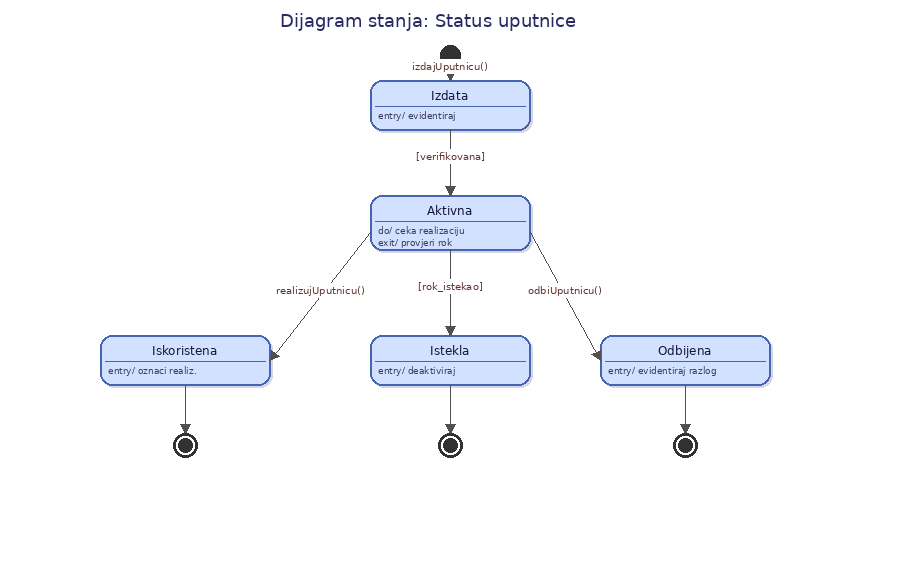

*Slika 3.4.2.3. Dijagram stanja za entitet Uputnica*

---

**Status korisničkog naloga**

Korisnički nalog prolazi kroz stanja: *Registrovan* → *Čeka verifikaciju* → *Aktivan*. Iz stanja *Aktivan* može preći u *Blokiran* (administrator blokira nalog), a zatim u *Deaktiviran* (soft delete). Iz stanja *Čeka verifikaciju* prelazi u *Istekao* ako verifikacija nije izvršena u roku od 24 sata.

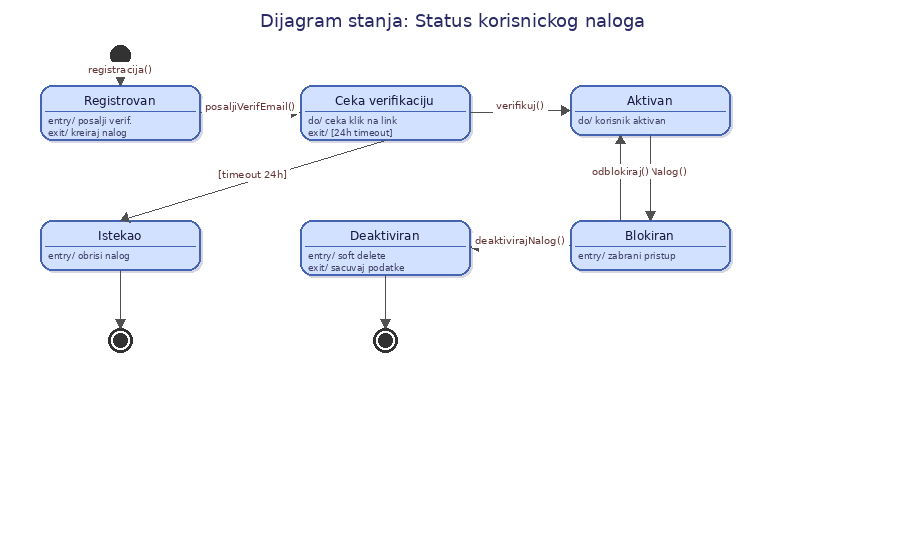

*Slika 3.4.2.4. Dijagram stanja za entitet Korisnički nalog*

---

## 3.5. Atributi sistema

U ovom poglavlju opisani su ključni nefunkcionalni zahtjevi sistema *Dom zdravlja*, koji definišu kvalitativne karakteristike koje sistem mora zadovoljiti.

### 3.5.1. Pouzdanost

Sistem *Dom zdravlja* mora biti izuzetno pouzdan s obzirom na to da upravlja osjetljivim medicinskim podacima i kritičnim procesima zakazivanja pregleda, izdavanja recepata i uputnica.

- **Tolerancija na greške:** U slučaju neočekivane greške, sistem ne smije izgubiti podatke pacijenata niti već zakazane termine. Svaka transakcija u bazi podataka mora biti atomarna (ACID principi).
- **Automatski backup:** Baza podataka se automatski backup-uje svaka 24 sata, sa mogućnošću ručnog pokretanja backup-a od strane administratora.
- **Logovanje grešaka:** Sve greške u sistemu se bilježe u log fajlove (korištenjem Laravel Log sistema) koji su dostupni administratoru radi dijagnostike i otklanjanja problema.
- **Validacija unosa:** Svi korisnički unosi se validiraju na strani klijenta (JavaScript) i servera (Laravel validation) kako bi se spriječilo unošenje neispravnih podataka.
- **Oporavak nakon pada:** U slučaju pada servera, sistem se automatski restartuje, a nezavršene transakcije se poništavaju (rollback) kako bi se očuvala konzistentnost podataka.

### 3.5.2. Dostupnost

Sistem je realizovan kao **web aplikacija**, što znači da je dostupan putem bilo kojeg modernog web pretraživača (Google Chrome, Mozilla Firefox, Microsoft Edge, Safari) bez potrebe za instalacijom dodatnog softvera.

- **Dostupnost 24/7:** Sistem mora biti dostupan 24 sata dnevno, 7 dana u sedmici, sa maksimalnim dozvoljenim nedostupnošću od 0.1% godišnje (SLA 99.9%).
- **Responzivan dizajn:** Korisničko sučelje je prilagođeno različitim veličinama ekrana — desktop, tablet i mobilni uređaji — zahvaljujući korištenju responzivnog CSS dizajna.
- **Nezavisnost od platforme:** Budući da je sistem web-baziran, korisnici mogu pristupiti sa bilo kojeg operativnog sistema (Windows, macOS, Linux, Android, iOS).
- **Planirano održavanje:** Unaprijed planirani prekidi rada (maintenance window) izvode se u periodu najmanje aktivnosti (npr. 02:00–04:00), uz obavještenje korisnicima najmanje 24 sata unaprijed.

### 3.5.3. Zaštita

S obzirom na to da sistem obrađuje **osjetljive medicinske podatke** pacijenata, zaštita i sigurnost su od ključnog značaja. Sistem je projektovan u skladu sa principima zaštite ličnih podataka (GDPR).

- **Autentikacija:** Korisnici se prijavljuju korištenjem jedinstvenog korisničkog imena (e-mail) i lozinke. Lozinke se čuvaju hashirane korištenjem **bcrypt** algoritma.
- **Autorizacija:** Pristup funkcionalnostima sistema je ograničen prema ulozi korisnika (Pacijent, Ljekar, Medicinska sestra, Administrator) korištenjem Laravel middleware-a i policy klasa.
- **HTTPS enkripcija:** Sva komunikacija između klijenta i servera se odvija putem HTTPS protokola (TLS 1.2+), čime se sprečava presretanje podataka.
- **Zaštita od CSRF napada:** Laravel automatski generiše i provjerava CSRF tokene za sve forme, čime se sprečavaju Cross-Site Request Forgery napadi.
- **Zaštita od SQL Injection:** Korištenjem Eloquent ORM-a i pripremljenih upita (prepared statements) eliminiše se rizik od SQL Injection napada.
- **Zaštita od XSS napada:** Svi korisnički unosi se escape-uju pri prikazu u Blade template-ima korištenjem `{{ }}` sintakse.
- **Kontrola pristupa medicinskim podacima:** Ljekar može pristupiti zdravstvenom kartonu pacijenta samo ako je pacijent zakazan kod njega ili ako postoji uputnica. Administrator nema pristup medicinskim podacima pacijenata.
- **Audit log:** Sistem bilježi sve kritične akcije (prijava, izmjena podataka, pristup kartonima) u audit log tabelu radi naknadne revizije.
- **Sesija i timeout:** Korisnička sesija automatski ističe nakon 30 minuta neaktivnosti, čime se smanjuje rizik od neovlaštenog pristupa.

### 3.5.5. Održivost

Sistem je projektovan sa ciljem lake održivosti i proširivosti.

- **MVC arhitektura:** Korištenjem Laravel MVC obrasca, poslovna logika, prezentacija i pristup podacima su jasno razdvojeni, što olakšava budući razvoj i održavanje.
- **Modularna struktura:** Funkcionalnosti su organizovane u logičke module (Pacijenti, Ljekari, Pregledi, Recepti, Uputnice, Raspored, Administracija), što omogućava nezavisno proširivanje pojedinih dijelova sistema.
- **Dokumentovani API:** Ako se sistem u budućnosti proširi mobilnom aplikacijom, backend API je dokumentovan i spreman za integraciju.
- **Verzionisanje baze podataka:** Korištenjem Laravel migracija, sve promjene strukture baze podataka su verzionisane i mogu se reproducirati na bilo kojem okruženju.
- **Automatizovano testiranje:** Sistem podržava pisanje unit i feature testova (PHPUnit), čime se smanjuje rizik od regresije prilikom ažuriranja.
- **Laravel ekosistem:** Korištenjem Laravel-ovog ekosistema (Composer paketi, Artisan komande), sistem se lako ažurira i održava.

### 3.5.6. Prednosti

Sistem *Dom zdravlja* donosi brojne prednosti u odnosu na tradicionalni (papirni) sistem upravljanja zdravstvenim ustanovama:

- **Digitalizacija zdravstvenih kartona:** Eliminacija papirnih kartona smanjuje mogućnost gubitka ili oštećenja podataka, te ubrzava pristup informacijama.
- **Online zakazivanje:** Pacijenti mogu zakazati pregled iz udobnosti svog doma, bez čekanja u redu ili pozivanja telefonom.
- **Automatski podsjetnici:** Sistem šalje automatske podsjetnike pacijentima o zakazanim pregledima, čime se smanjuje broj propuštenih termina.
- **Elektronski recepti:** Ljekari mogu izdavati elektronske recepte koji se direktno šalju u apoteku, ubrzavajući proces preuzimanja lijekova.
- **Efikasno upravljanje rasporedom:** Medicinske sestre mogu efikasno planirati rasporede ljekara, uz automatsku provjeru konflikata termina.
- **Ocjenjivanje kvalitete usluge:** Pacijenti mogu ocijeniti ljekare nakon pregleda, čime se doprinosi poboljšanju kvalitete zdravstvene usluge.
- **Centralizovani pristup:** Svi podaci su centralizovani na jednom mjestu, dostupni ovlaštenim korisnicima u bilo kojem trenutku.
- **Smanjena administracija:** Automatizacija procesa (zakazivanje, recepti, uputnice) značajno smanjuje administrativno opterećenje medicinskog osoblja.
- **Skalabilnost:** Sistem se može lako prilagoditi za korištenje u većim zdravstvenim ustanovama sa više odjeljenja i ljekara.

---

## 4. Dodaci

### 4.1. Dodatak A — Dijagram konteksta web aplikacije
Dijagram konteksta prikazuje sistem *Dom zdravlja* kao cjelinu i njegove interakcije sa spoljnim entitetima (aktorima). Dijagram pokazuje granice sistema — šta pripada sistemu, a šta je izvan njega — te kako spoljni entiteti komuniciraju sa sistemom.

**Spoljni entiteti:**
- **Pacijent** — registruje se, zakazuje preglede, pregledava zdravstveni karton, recepte, uputnice, ocjenjuje ljekare.
- **Ljekar** — vodi preglede, pristupa zdravstvenim kartonima, izdaje recepte i uputnice, pregledava raspored.
- **Medicinska sestra** — upravlja rasporedom ljekara, vrši prijem i trijažu pacijenata.
- **Administrator** — upravlja korisnicima, konfiguriše sistem, pregledava logove i statistiku.
- **Gost** — pregledava javno dostupne informacije o domu zdravlja.
- **E-mail servis (SMTP)** — sistem šalje e-mail obavještenja korisnicima (potvrde, podsjetnici, obavještenja).
- **Web pretraživač (klijent)** — korisnici pristupaju sistemu putem web pretraživača koristeći HTTPS protokol.

**Tokovi podataka između sistema i spoljnih entiteta:**

| Spoljni entitet | Ka sistemu | Od sistema |
|-----------------|-----------|-----------|
| **Gost** | Zahtjev za registraciju, pregled informacija | Informacije o domu zdravlja (radno vrijeme, kontakt, odjeljenja, ljekari) |
| **Pacijent** | Prijava, zakazivanje/otkazivanje pregleda, pregled kartona/recepata/uputnica, ocjenjivanje ljekara | Dashboard sa terminima, zdravstveni karton, lista recepata/uputnica, potvrde akcija |
| **Ljekar** | Prijava, vođenje pregleda, dodavanje dijagnoze/terapije, izdavanje recepata/uputnica | Raspored pregleda, zdravstveni kartoni pacijenata, istorija pregleda |
| **Medicinska sestra** | Prijava, kreiranje/izmjena rasporeda, prijem pacijenta, trijaža | Dnevni raspored ordinacije, lista zakazanih pacijenata |
| **Administrator** | Prijava, CRUD operacije nad korisnicima, konfiguracija sistema | Lista korisnika, sistemski logovi, statistički izvještaji |
| **E-mail servis** | — | Verifikacioni e-mailovi, potvrde termina, podsjetnici, obavještenja o receptima/uputnicama |

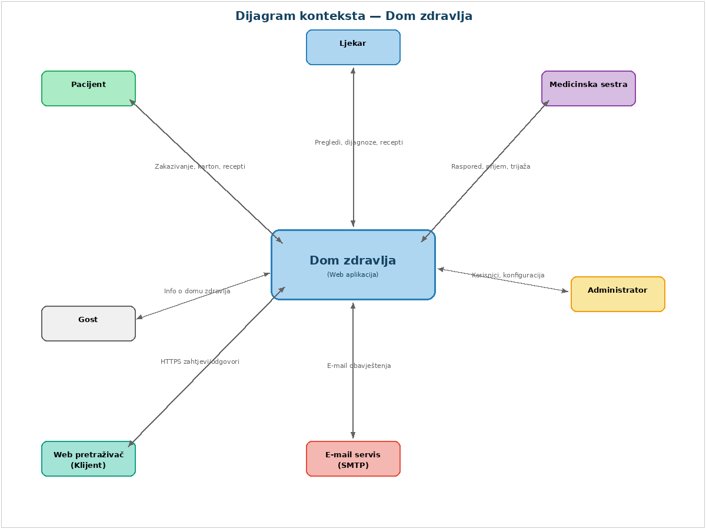

*Slika 4.1.1. Dijagram konteksta web aplikacije Dom zdravlja*

---

### 4.2. Dodatak B — Model baze podataka

Model baze podataka prikazuje fizičku strukturu relacione baze podataka sistema *Dom zdravlja*. Dijagram entiteta i veza (ER dijagram) prikazuje sve tabele, njihove kolone (atribute), tipove podataka, primarne i strane ključeve, te relacije između tabela.

**Tabele baze podataka:**

| Tabela | Opis | Primarni ključ |
|--------|------|----------------|
| **korisnici** | Svi korisnici sistema (pacijenti, ljekari, med. sestre, administratori) | id |
| **uloge** | Definicija uloga u sistemu (pacijent, ljekar, med. sestra, administrator) | id |
| **korisnik_uloga** | Pivot tabela za vezu korisnik–uloga (M:N relacija) | id |
| **odjeljenja** | Organizacione jedinice doma zdravlja | id |
| **ordinacije** | Fizički prostori za preglede (pripadaju odjeljenju) | id |
| **specijalizacije** | Lista ljekarskih specijalizacija | id |
| **zdravstveni_kartoni** | Medicinska dokumentacija pacijenata (1:1 sa korisnikom/pacijentom) | id |
| **termini** | Vremenski slotovi u rasporedu ljekara | id |
| **pregledi** | Evidencija obavljenih medicinskih pregleda | id |
| **dijagnoze** | MKB-10 šifre bolesti | id |
| **recepti** | Elektronski recepti izdati pacijentima | id |
| **uputnice** | Elektronske uputnice za specijalističke preglede | id |
| **ocjene** | Ocjene ljekara od strane pacijenata | id |
| **trijaze** | Evidencija trijaže pacijenata (vitalni znakovi, kategorija hitnosti) | id |
| **rasporedi** | Definicija radnog vremena ljekara | id |
| **konfiguracija_sistema** | Ključ-vrijednost parovi za sistemske parametre | id |
| **sistemski_logovi** | Audit log — evidencija svih akcija u sistemu | id |
| **obavjestenja** | Interna obavještenja korisnicima | id |
| **email_logovi** | Evidencija svih poslanih e-mail poruka | id |

**Ključne relacije između tabela:**

| Relacija | Tip | Opis |
|----------|-----|------|
| korisnici ↔ uloge | M:N (preko korisnik_uloga) | Jedan korisnik može imati više uloga |
| korisnici → odjeljenja | N:1 | Ljekar/sestra pripada odjeljenju |
| korisnici → specijalizacije | N:1 | Ljekar ima specijalizaciju |
| korisnici ↔ zdravstveni_kartoni | 1:1 | Svaki pacijent ima tačno jedan karton |
| zdravstveni_kartoni ↔ pregledi | 1:N | Karton sadrži više pregleda |
| pregledi → termini | 1:1 | Pregled je vezan za termin |
| pregledi → dijagnoze | N:1 | Pregled ima dijagnozu (MKB-10) |
| pregledi ↔ recepti | 1:N | Pregled može imati više recepata |
| pregledi ↔ uputnice | 1:N | Pregled može imati više uputnica |
| pregledi ↔ ocjene | 1:0..1 | Pregled može imati jednu ocjenu |
| termini → korisnici (ljekar) | N:1 | Termin pripada ljekaru |
| termini → korisnici (pacijent) | N:1 | Termin je zakazan za pacijenta |
| rasporedi → korisnici (ljekar) | N:1 | Raspored je definisan za ljekara |
| rasporedi → korisnici (sestra) | N:1 | Raspored kreira med. sestra |
| trijaze → korisnici (pacijent) | N:1 | Trijaža je vezana za pacijenta |
| trijaze → korisnici (sestra) | N:1 | Trijažu vrši med. sestra |
| ordinacije → odjeljenja | N:1 | Ordinacija pripada odjeljenju |
| obavjestenja → korisnici | N:1 | Obavještenje je namijenjeno korisniku |
| sistemski_logovi → korisnici | N:1 | Log je vezan za korisnika koji je izvršio akciju |

**Struktura ključnih tabela:**

**Tabela: korisnici**

| Kolona | Tip | Ograničenja | Opis |
|--------|-----|-------------|------|
| id | BIGINT UNSIGNED | PK, AUTO_INCREMENT | Jedinstveni identifikator |
| ime | VARCHAR(100) | NOT NULL | Ime korisnika |
| prezime | VARCHAR(100) | NOT NULL | Prezime korisnika |
| email | VARCHAR(255) | NOT NULL, UNIQUE | E-mail adresa (koristi se za prijavu) |
| lozinka | VARCHAR(255) | NOT NULL | Hashirana lozinka (bcrypt) |
| jmbg | VARCHAR(13) | UNIQUE, NULLABLE | JMBG (samo za pacijente) |
| datum_rodjenja | DATE | NULLABLE | Datum rođenja |
| spol | ENUM('M','Ž') | NULLABLE | Spol |
| adresa | VARCHAR(255) | NULLABLE | Adresa stanovanja |
| telefon | VARCHAR(20) | NULLABLE | Broj telefona |
| fotografija | VARCHAR(255) | NULLABLE | Putanja do profilne fotografije |
| odjeljenje_id | BIGINT UNSIGNED | FK → odjeljenja.id, NULLABLE | Odjeljenje (za ljekare i sestre) |
| specijalizacija_id | BIGINT UNSIGNED | FK → specijalizacije.id, NULLABLE | Specijalizacija (za ljekare) |
| broj_licence | VARCHAR(50) | NULLABLE | Broj licence (za ljekare) |
| smjena | ENUM('jutarnja','popodnevna','noćna') | NULLABLE | Smjena (za med. sestre) |
| nivo_pristupa | TINYINT | DEFAULT 1 | Nivo pristupa (za administratore) |
| status | ENUM('aktivan','blokiran','deaktiviran') | NOT NULL, DEFAULT 'aktivan' | Status naloga |
| email_verificiran_u | TIMESTAMP | NULLABLE | Datum i vrijeme verifikacije e-maila |
| created_at | TIMESTAMP | NOT NULL | Datum kreiranja naloga |
| updated_at | TIMESTAMP | NOT NULL | Datum posljednje izmjene |
| deleted_at | TIMESTAMP | NULLABLE | Soft delete (logičko brisanje) |

**Tabela: pregledi**

| Kolona | Tip | Ograničenja | Opis |
|--------|-----|-------------|------|
| id | BIGINT UNSIGNED | PK, AUTO_INCREMENT | Jedinstveni identifikator |
| zdravstveni_karton_id | BIGINT UNSIGNED | FK → zdravstveni_kartoni.id, NOT NULL | Karton pacijenta |
| termin_id | BIGINT UNSIGNED | FK → termini.id, NOT NULL | Pripadajući termin |
| ljekar_id | BIGINT UNSIGNED | FK → korisnici.id, NOT NULL | Ljekar koji vodi pregled |
| dijagnoza_id | BIGINT UNSIGNED | FK → dijagnoze.id, NULLABLE | MKB-10 dijagnoza |
| nalaz | TEXT | NULLABLE | Nalaz pregleda |
| terapija | TEXT | NULLABLE | Propisana terapija |
| biljeske | TEXT | NULLABLE | Dodatne bilješke ljekara |
| status | ENUM('zakazan','primljen','u_toku','zavrsen','otkazan','neostvaren') | NOT NULL, DEFAULT 'zakazan' | Status pregleda |
| created_at | TIMESTAMP | NOT NULL | Datum kreiranja |
| updated_at | TIMESTAMP | NOT NULL | Datum posljednje izmjene |

**Tabela: recepti**

| Kolona | Tip | Ograničenja | Opis |
|--------|-----|-------------|------|
| id | BIGINT UNSIGNED | PK, AUTO_INCREMENT | Jedinstveni identifikator |
| pregled_id | BIGINT UNSIGNED | FK → pregledi.id, NOT NULL | Pripadajući pregled |
| naziv_lijeka | VARCHAR(255) | NOT NULL | Naziv lijeka |
| doza | VARCHAR(100) | NOT NULL | Doza (npr. "500 mg") |
| nacin_primjene | ENUM('oralno','intravenski','intramuskularno','lokalno','inhalaciono','rektalno') | NOT NULL | Način primjene |
| ucestalost | VARCHAR(100) | NOT NULL | Učestalost (npr. "3 puta dnevno") |
| trajanje_terapije | VARCHAR(100) | NOT NULL | Trajanje (npr. "7 dana") |
| napomene | TEXT | NULLABLE | Posebne napomene |
| status | ENUM('izdat','aktivan','iskoristen','istekao') | NOT NULL, DEFAULT 'izdat' | Status recepta |
| rok_vazenja | DATE | NOT NULL | Rok važenja recepta |
| created_at | TIMESTAMP | NOT NULL | Datum izdavanja |
| updated_at | TIMESTAMP | NOT NULL | Datum posljednje izmjene |

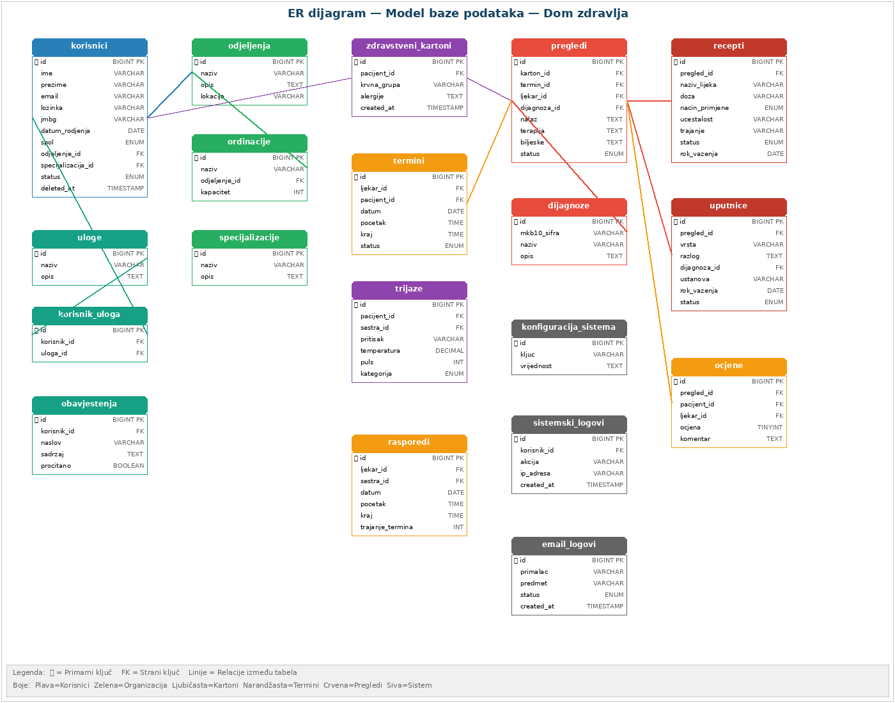

*Slika 4.2.1. ER dijagram (model baze podataka) sistema Dom zdravlja*

---

### 4.3. Dodatak C — Mockup web aplikacije
U ovom poglavlju prikazane su makete (wireframe) ključnih ekrana web aplikacije *Dom zdravlja*. Makete ilustruju izgled i raspored elemenata korisničkog interfejsa za svaki zahtjev iz poglavlja 3.2. Dizajn je zasnovan na responzivnom Bootstrap 5 framework-u.

---

**G1: Registracija pacijenta**
Stranica za registraciju sadrži formu sa svim obaveznim poljima: ime, prezime, JMBG, datum rođenja, spol, adresa, telefon, e-mail, lozinka i ponovljena lozinka. Na dnu forme nalaze se dugmad "Registrujte se" i "Odustanite". Zaglavlje stranice sadrži logo doma zdravlja i navigacioni meni za goste.

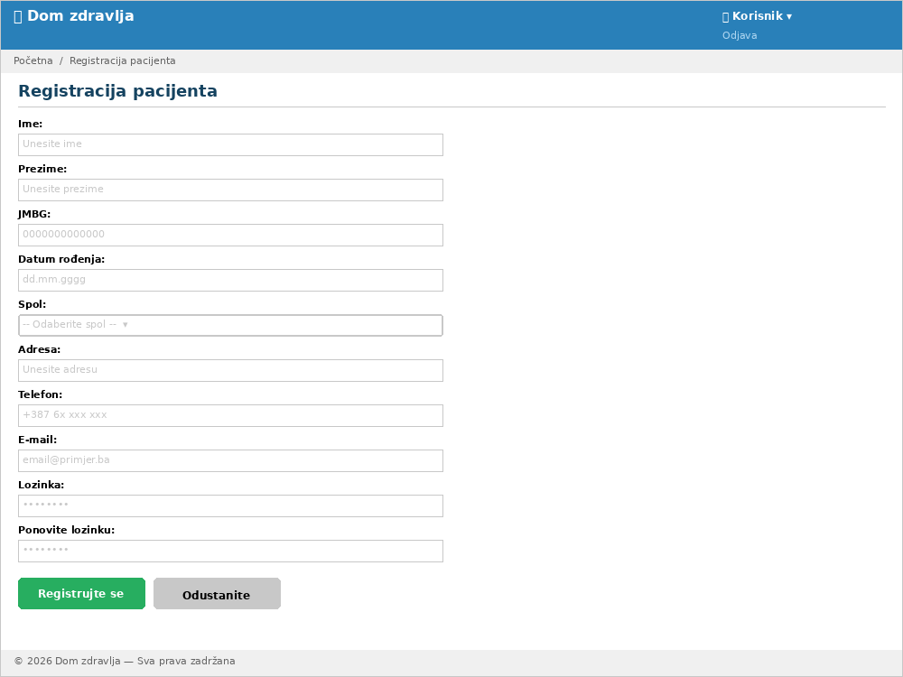

*Slika 4.3.1. Registracija pacijenta*

---

**K1: Prijava korisnika**
Stranica za prijavu sadrži dva polja (e-mail i lozinka), dugme "Prijavite se", te link "Registrujte se" za goste koji nemaju nalog. Dizajn je centriran na stranici sa logom doma zdravlja iznad forme.

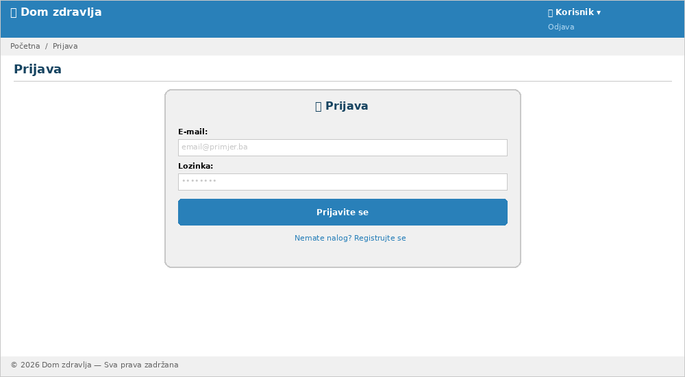

*Slika 4.3.2. Prijava korisnika*

---

**K2: Podešavanje profila**
Stranica za podešavanje profila sadrži formu sa editabilnim poljima (adresa, telefon, fotografija) i posebnu sekciju za promjenu lozinke (stara lozinka, nova lozinka, ponovljena nova lozinka). Na dnu su dugmad "Potvrdite" i "Odustanite". Navigacioni meni je prilagođen ulozi prijavljenog korisnika.

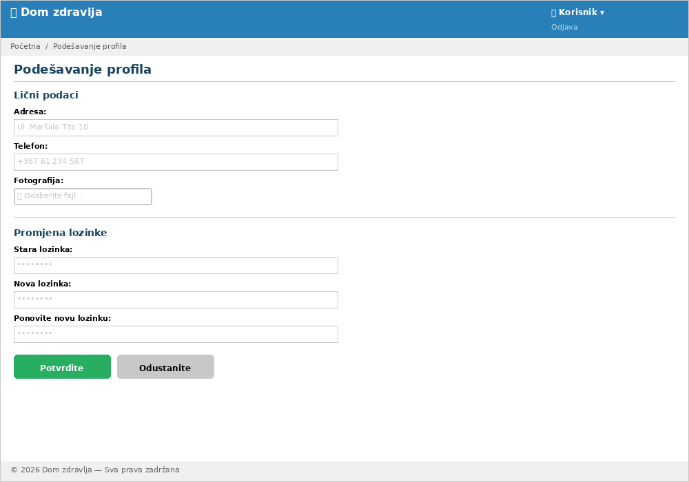

*Slika 4.3.3. Podešavanje profila*

---

**K3: Odjava**
Odjava se vrši klikom na link "Odjava" u padajućem meniju korisničkog imena u zaglavlju. Nakon odjave, korisnik se preusmjerava na početnu stranicu.

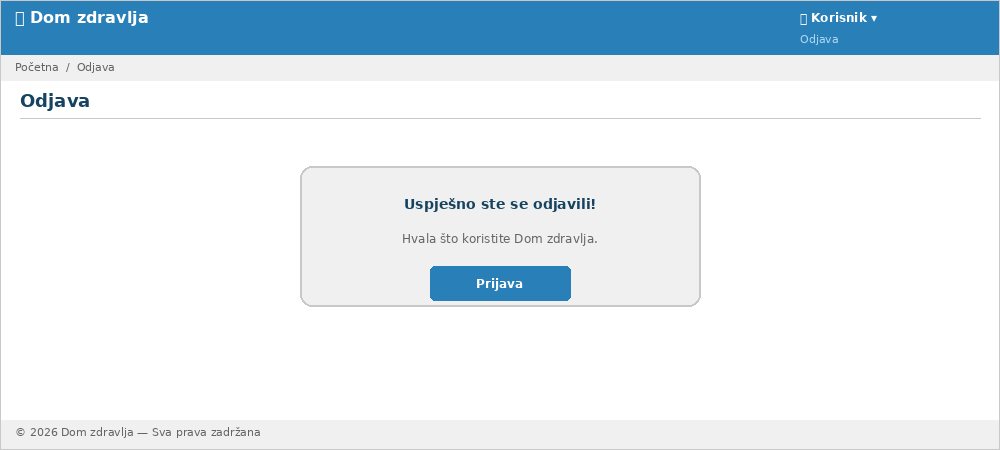

*Slika 4.3.4. Odjava korisnika*

---

**G2: Pregled informacija o domu zdravlja**
Početna (javna) stranica prikazuje osnovne informacije o domu zdravlja: radno vrijeme, adresu, kontakt telefon, e-mail. U glavnom meniju nalaze se linkovi "Odjeljenja" i "Ljekari" koji vode na odgovarajuće liste. U gornjem desnom uglu nalaze se linkovi "Prijava" i "Registracija".

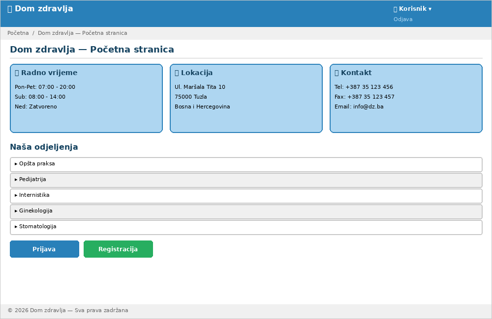

*Slika 4.3.5. Početna stranica (informacije o domu zdravlja)*

---

**P1: Zakazivanje pregleda**
Stranica za zakazivanje pregleda sadrži: padajuću listu za odabir odjeljenja, padajuću listu za odabir ljekara (filtriranu po odjeljenju), kalendar za odabir datuma (sa označenim slobodnim danima), listu slobodnih termina za odabrani datum, polje za unos razloga posjete (opciono), te dugmad "Zakaži pregled" i "Odustanite".

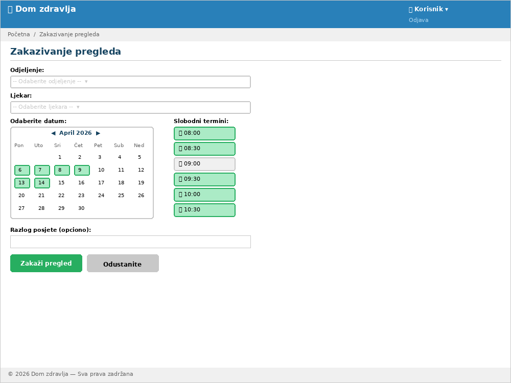

*Slika 4.3.6. Zakazivanje pregleda*

---

**P1.1: Otkazivanje zakazanog pregleda**
Stranica "Moji termini" prikazuje tabelu zakazanih pregleda sa kolonama: datum, vrijeme, ljekar, odjeljenje, status. Pored svakog termina koji je moguće otkazati (>24h do termina) nalazi se dugme "Otkažite". Klikom na "Otkažite" pojavljuje se potvrdni dijalog sa dugmadima "Da" i "Ne".

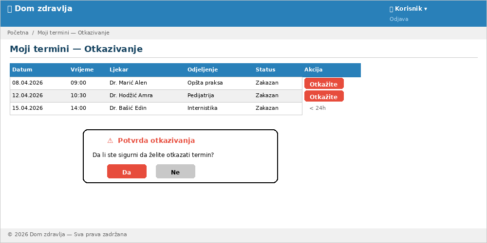

*Slika 4.3.7. Otkazivanje zakazanog pregleda*

---

**P2: Pregled zdravstvenog kartona**
Stranica "Moj karton" prikazuje zdravstveni karton pacijenta u tabelarnom obliku sa kolonama: datum, ljekar, dijagnoza (MKB-10 šifra i naziv), terapija, bilješke. Iznad tabele nalaze se filteri za pretragu po datumu, ljekaru i tipu zapisa.

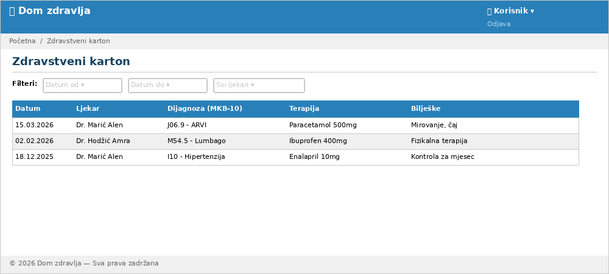

*Slika 4.3.8. Pregled zdravstvenog kartona*

---

**P3: Pregled izdatih recepata**
Stranica "Moji recepti" prikazuje listu recepata u tabelarnom obliku sa kolonama: datum izdavanja, naziv lijeka, doza, način primjene, ljekar, status (aktivan/istekao). Iznad tabele nalaze se filteri za pretragu po statusu i datumu. Klikom na red otvara se detaljan prikaz recepta.

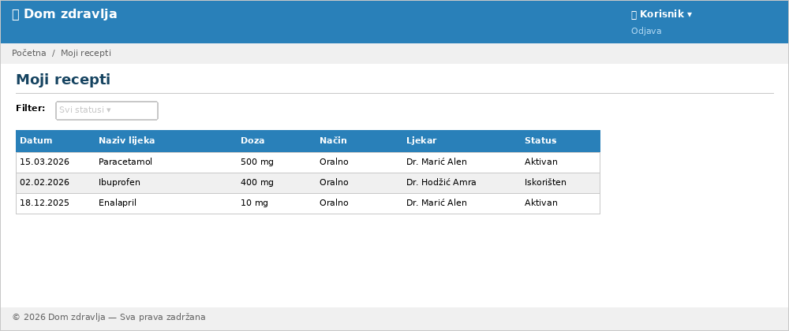

*Slika 4.3.9. Pregled izdatih recepata*

---

**P4: Pregled izdatih uputnica**
Stranica "Moje uputnice" prikazuje listu uputnica u tabelarnom obliku sa kolonama: datum izdavanja, vrsta pregleda/procedure, razlog upućivanja, ljekar, ustanova, rok važenja, status (aktivna/iskorištena/istekla). Filteri za pretragu po statusu i datumu.

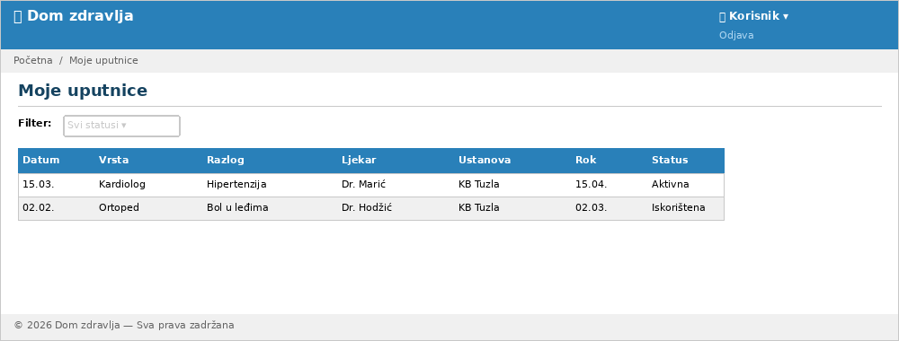

*Slika 4.3.10. Pregled izdatih uputnica*

---

**P5: Ocjenjivanje ljekara**
Forma za ocjenjivanje ljekara sadrži: prikaz informacija o pregledu (datum, ljekar), vizuelni odabir ocjene (1–5 zvjezdica — klikom na zvjezdicu), polje za unos komentara (opciono), te dugmad "Pošaljite ocjenu" i "Odustanite".

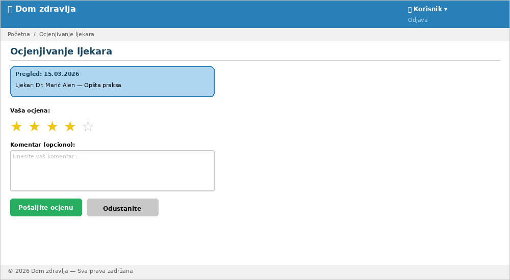

*Slika 4.3.11. Ocjenjivanje ljekara*

---

**L1: Pregled rasporeda ljekara**
Dashboard ljekara prikazuje raspored u kalendarskom obliku sa tri prikaza: dnevni, sedmični i mjesečni (prebacivanje klikom na odgovarajuće dugme). Svaki termin u kalendaru sadrži ime pacijenta, vrijeme i kratki opis razloga posjete. Zakazani termini su označeni bojom u zavisnosti od statusa (zakazan, primljen, u toku, završen).

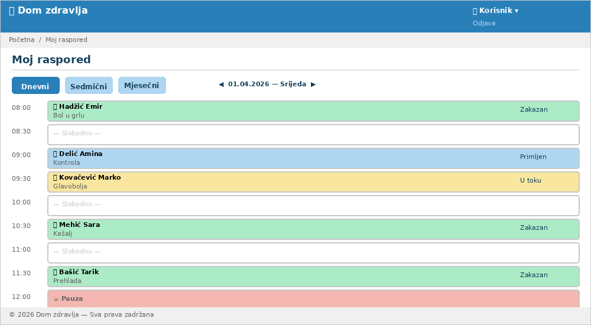

*Slika 4.3.12. Pregled rasporeda ljekara*

---

**L2: Vođenje pregleda pacijenta**
Stranica za vođenje pregleda sadrži: podatke o pacijentu (ime, prezime, JMBG, datum rođenja) u zaglavlju, zdravstveni karton sa prethodnim pregledima/dijagnozama u lijevoj koloni, formu za unos nalaza, odabir dijagnoze (MKB-10 pretraga), unos terapije i bilješki u desnoj koloni. Na dnu su dugmad "Završi pregled" i "Odustanite", te dugmad "Izdaj recept" i "Izdaj uputnicu".

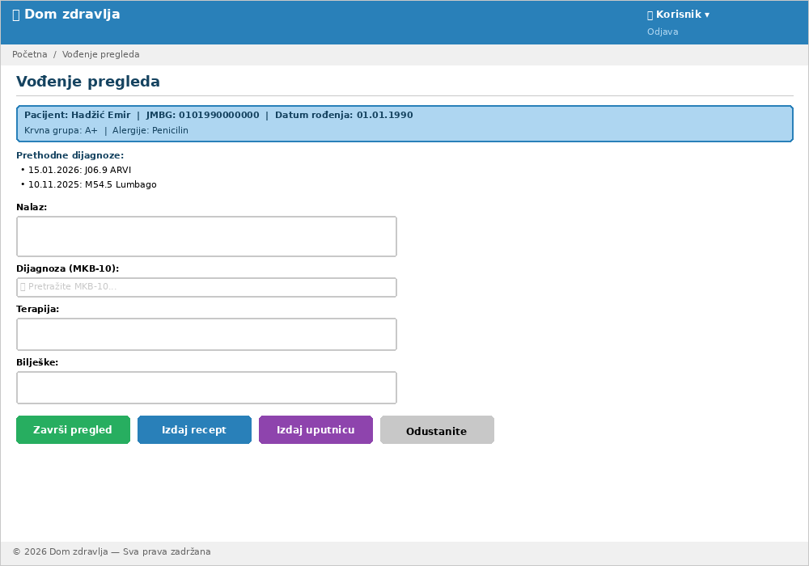

*Slika 4.3.13. Vođenje pregleda pacijenta*

---

**L3: Izdavanje recepta**
Forma za izdavanje recepta sadrži: padajuću listu za naziv lijeka (sa pretragom), polja za dozu, način primjene (padajuća lista), učestalost, trajanje terapije i napomene. Na dnu su dugmad "Izdaj recept" i "Odustanite".

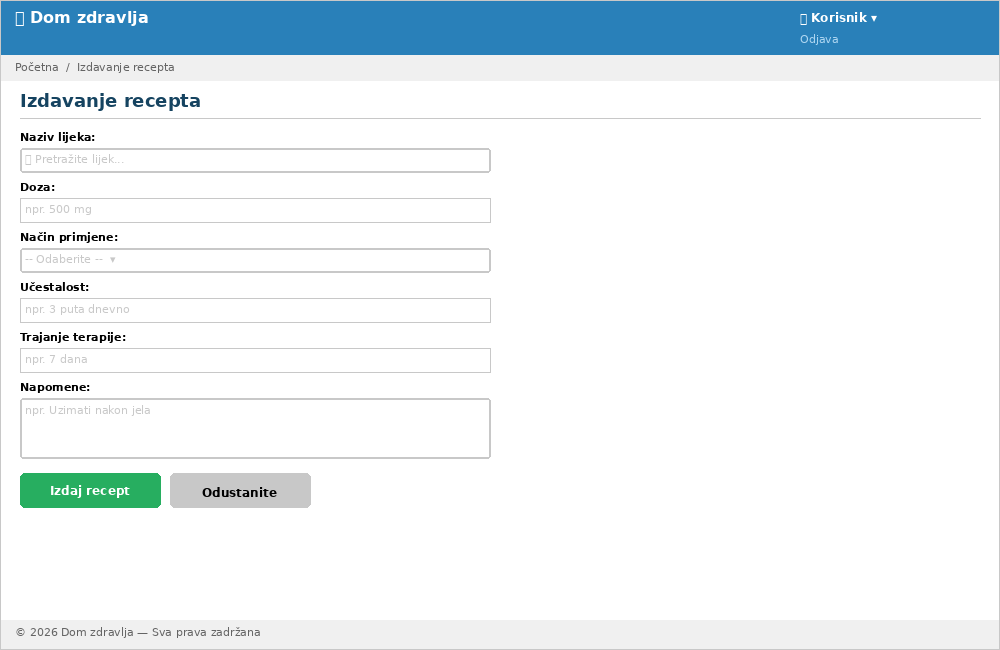

*Slika 4.3.14. Izdavanje recepta*

---

**L4: Izdavanje uputnice**
Forma za izdavanje uputnice sadrži: padajuću listu za vrstu pregleda/procedure, polje za razlog upućivanja, odabir dijagnoze (MKB-10), padajuću listu za ustanovu, polje za rok važenja (podrazumijevano 30 dana) i napomene. Na dnu su dugmad "Izdaj uputnicu" i "Odustanite".

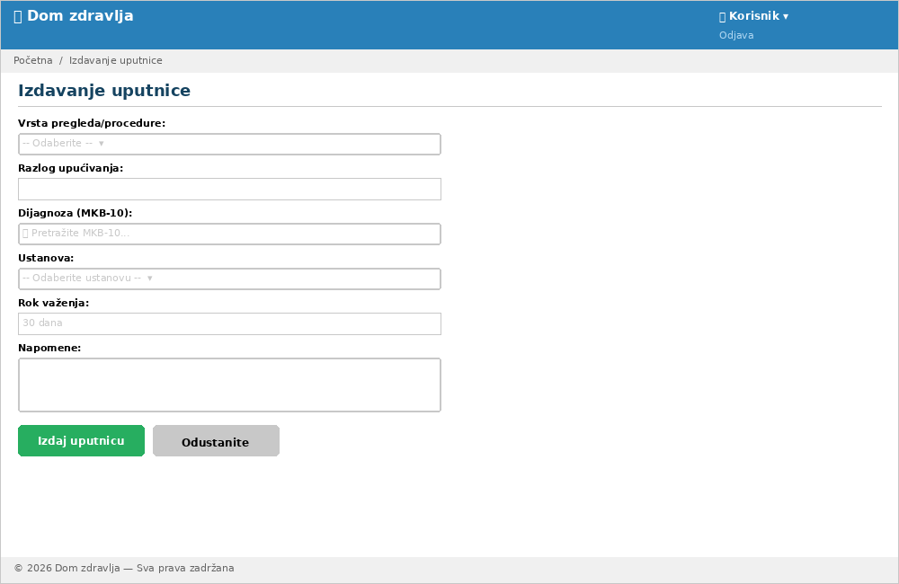

*Slika 4.3.15. Izdavanje uputnice*

---

**S1: Upravljanje rasporedom ljekara**
Stranica za upravljanje rasporedom sadrži: padajuću listu za odabir ljekara, kalendarski prikaz postojećih termina, formu za kreiranje novih termina (datum, početak/kraj radnog vremena, trajanje termina, pauza). Na dnu su dugmad "Sačuvajte raspored" i "Odustanite". Postojeći termini sa zakazanim pacijentima su označeni posebnom bojom sa upozorenjem da ih nije moguće obrisati bez prethodnog obavještenja pacijenta.

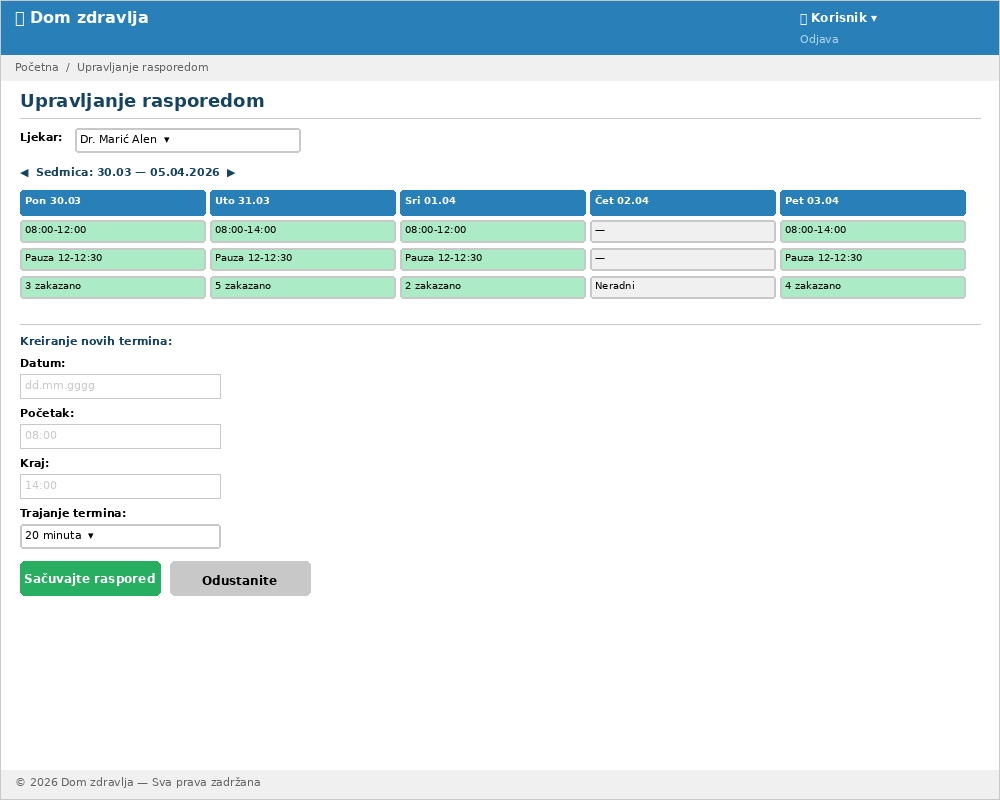

*Slika 4.3.16. Upravljanje rasporedom ljekara*

---

**S2: Prijem pacijenta**
Stranica "Prijem pacijenata" prikazuje tabelu zakazanih pacijenata za trenutni dan sa kolonama: vrijeme, ime i prezime pacijenta, ljekar, status (čeka/primljen/odsutan). Pored svakog pacijenta sa statusom "čeka" nalazi se dugme "Primi pacijenta". Pored pacijenata koji se nisu pojavili nalazi se dugme "Označi kao odsutan".

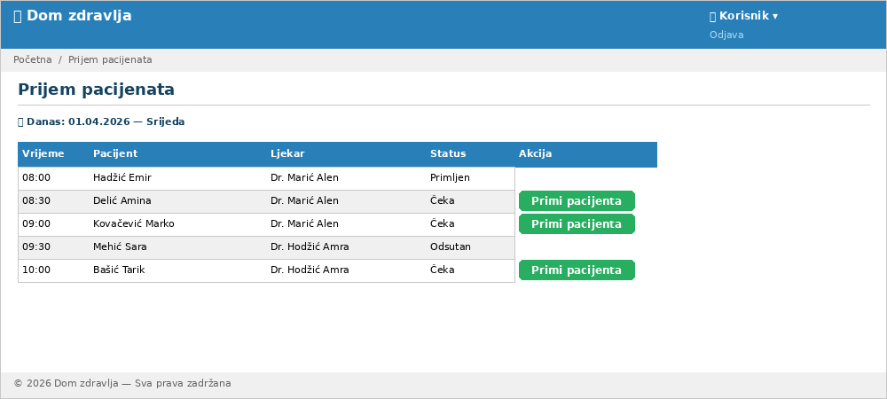

*Slika 4.3.17. Prijem pacijenta*

---

**S3: Trijaža pacijenta**
Forma za trijažu sadrži: podatke o pacijentu u zaglavlju, polja za vitalne znakove (krvni pritisak, temperatura, puls), padajuću listu za kategoriju hitnosti (1–Hitno, 2–Urgentno, 3–Manje urgentno, 4–Neurgentno, 5–Rutinsko), padajuću listu za odabir ljekara/odjeljenja, polje za napomene. Na dnu su dugmad "Sačuvajte" i "Odustanite".

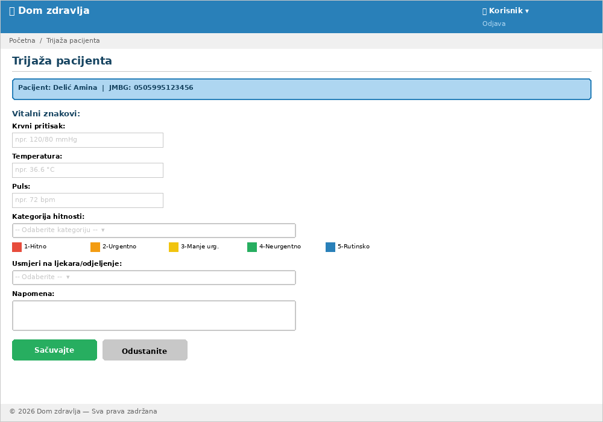

*Slika 4.3.18. Trijaža pacijenta*

---

**A1: Pregled korisnika**
Stranica "Korisnici" prikazuje tabelu svih korisnika sa kolonama: ime, prezime, e-mail, uloga, status. Iznad tabele nalaze se polje za pretragu i filteri po ulozi. Iznad tabele je dugme "Dodaj korisnika". Pored svakog korisnika nalaze se dugmad "Izmijenite", "Promijeni ulogu" i "Obrišite".

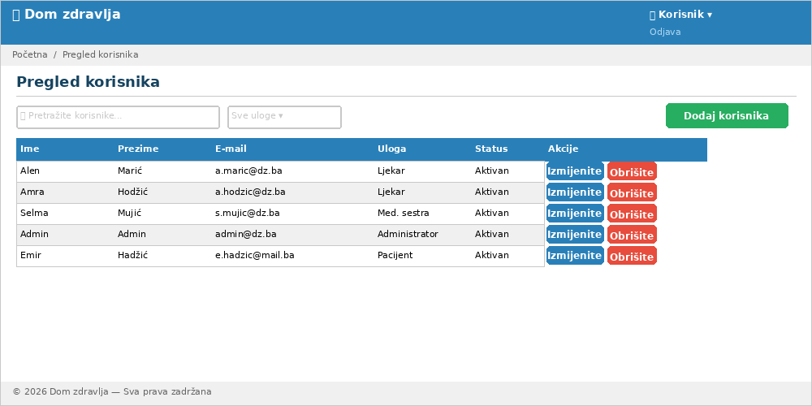

*Slika 4.3.19. Pregled korisnika*

---

**A1.1: Unos novog korisnika**
Forma za unos novog korisnika sadrži polja: ime, prezime, e-mail, uloga (padajuća lista), odjeljenje (padajuća lista — za ljekare i sestre), specijalizacija (padajuća lista — za ljekare), lozinka, ponovljena lozinka, fotografija (upload). Na dnu su dugmad "Sačuvajte" i "Odustanite".

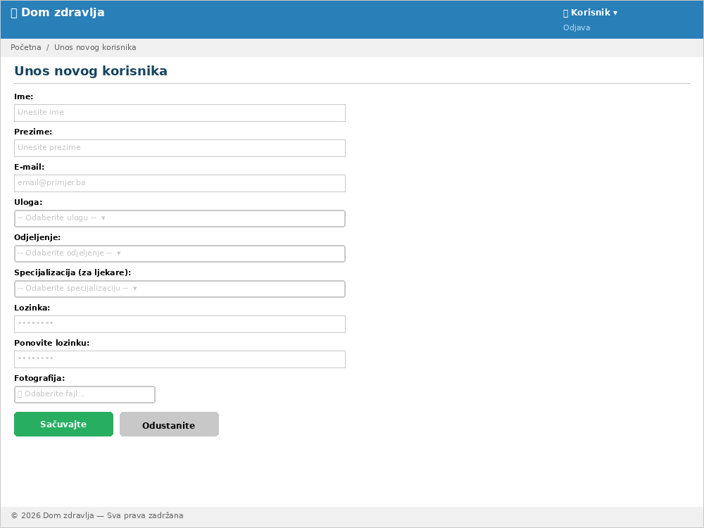

*Slika 4.3.20. Unos novog korisnika*

---

**A2: Konfiguracija sistema**
Stranica "Konfiguracija" sadrži kartice (tabove) za različite sekcije: "Radno vrijeme" (tabela sa danima u sedmici i početkom/krajem radnog vremena), "Odjeljenja" (CRUD tabela), "Ordinacije" (CRUD tabela sa pripadajućim odjeljenjem), "Specijalnosti" (CRUD tabela), "Trajanje termina" (padajuća lista: 15/20/30 minuta). Na dnu svake sekcije su dugmad "Sačuvajte" i "Odustanite".

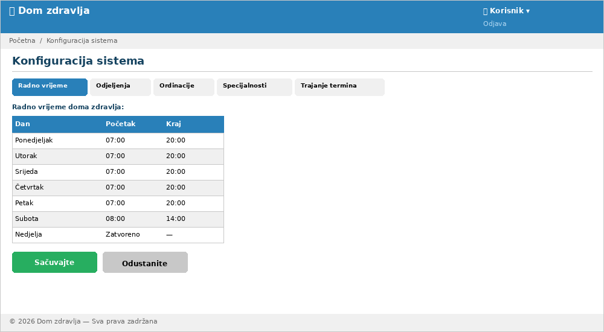

*Slika 4.3.21. Konfiguracija sistema*

---

**A3: Pregled sistemskih logova i statistike**
Stranica "Izvještaji" sadrži kartice za različite vrste izvještaja: "Sistemski logovi" (tabela sa kolonama: datum/vrijeme, korisnik, akcija, IP adresa), "Statistika pregleda" (grafički prikaz broja pregleda po danima/sedmicama/mjesecima), "Statistika korisnika" (aktivni, novi registrovani), "Statistika recepata i uputnica". Iznad svake sekcije nalaze se filteri za datumski raspon. Dugme "Eksportuj" omogućava eksport izvještaja u PDF ili CSV format.

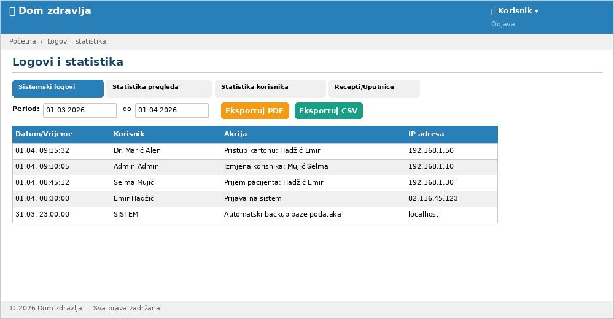

*Slika 4.3.22. Pregled sistemskih logova i statistike*
